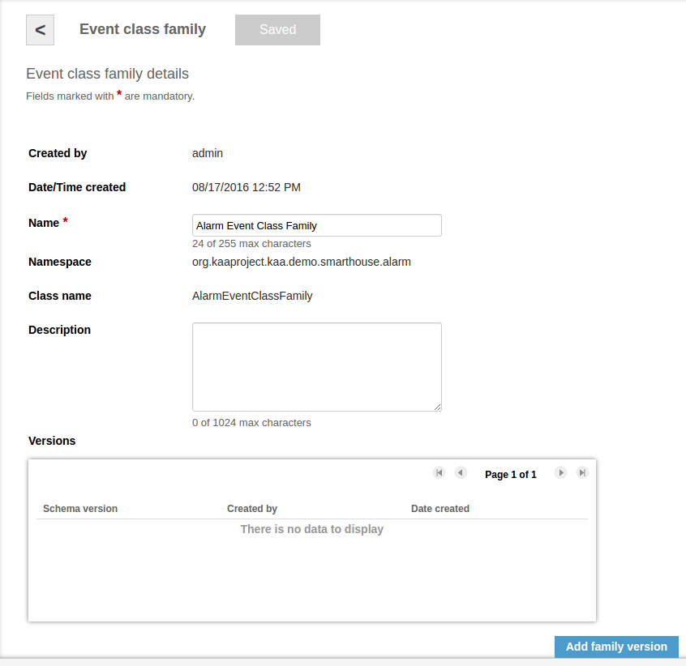
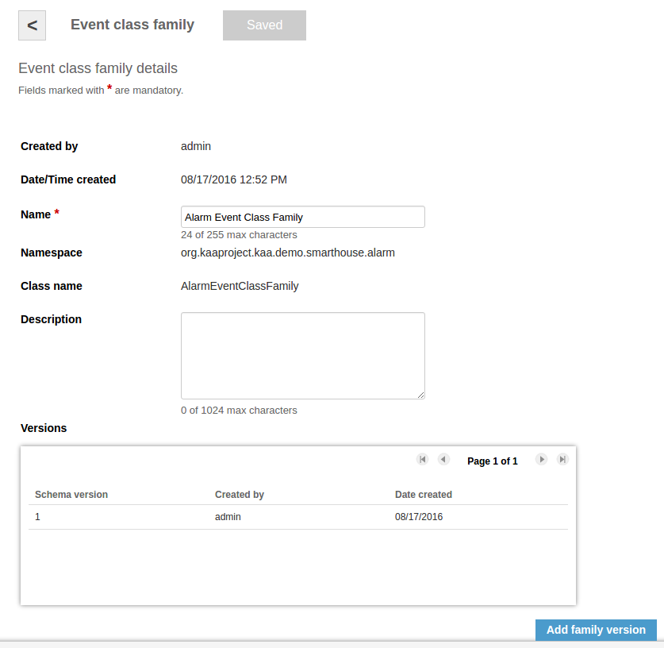
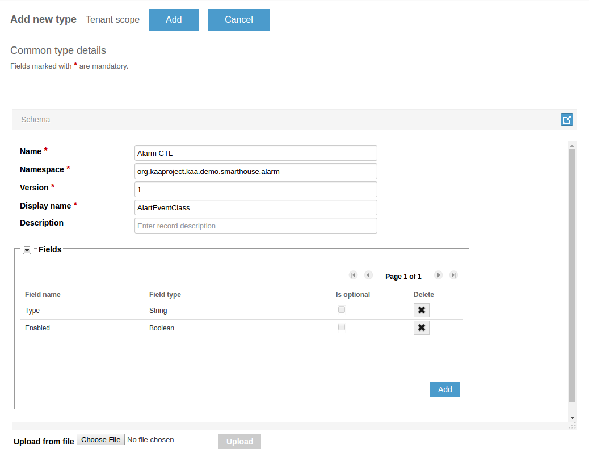
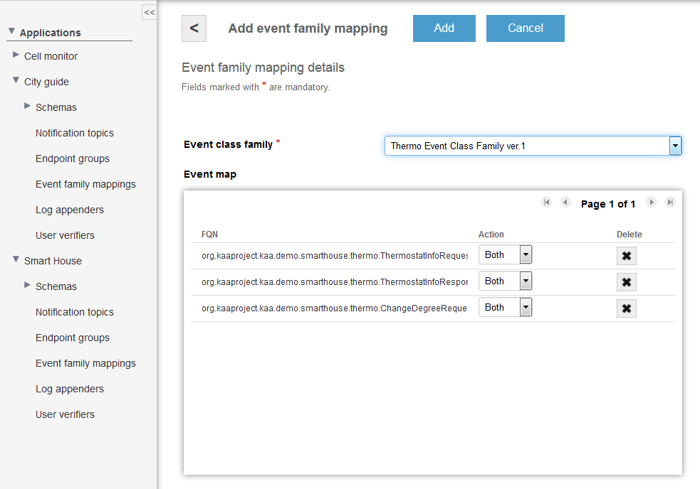



* TOC
{:toc}

The Kaa Event subsystem enables generation of events on endpoints in near real-time fashion, handling those events on a Kaa server, and dispatching them to other endpoints that belong to the same user (potentially, across different applications). The Kaa event structure is determined by a configurable [CTL schema]({{root_url}}Programming-guide/Key-platform-features/Common-Type-Library/).

The Kaa Event subsystem provides the following features.

* Generation of the event object model and related API calls in the endpoint SDK
* Enforcement of data integrity and validity
* Efficient targeting of event recipients
* Efficient and compact serialization

## Event generation and handling overview

Process of event generation and handling described on the following diagram:


It is the developer's responsibility to design event class schemas and make the client application interpret event data supplied by the endpoint library. The Kaa administrator, in turn, can provision those schemas into the Kaa server and generate the endpoint SDK.

## Event class

Each event is based on a particular event class (EC) that is defined by the corresponding [CTL schema]({{root_url}}Programming-guide/Key-platform-features/Common-Type-Library/) with the additional attribute classType that supports two values: event and object. Kaa uses the classType attribute to distinguish actual events from objects, which are reusable parts of events. This is useful for avoiding redundant methods in SDK API.

The following examples illustrate basic event class CTL schemas.

* The simplest definition of an event with the com.company.project.SimpleEvent1 FQN and no data fields, classType is event.

```json
{  
    "namespace":"com.company.project",
    "type":"record",
    "name":"SimpleEvent1",
    "fields":[  

    ]
}
```

* The event definition with the com.company.project.SimpleEvent2 FQN and two data fields (field1 and field2), classType is event.

```json
{  
    "namespace":"com.company.project",
    "type":"record",
    "name":"SimpleEvent2",
    "fields":[  
        {  
            "name":"field1",
            "type":"int"
        },
        {  
            "name":"field2",
            "type":"string"
        }
    ]
}
```

* The event definition with the com.company.project.ComplexEvent (classType is event) FQN and two complex fields (classType of each is object): com.company.project.SimpleRecordObject and com.company.project.SimpleEnumObject.

```json
{  
    "namespace":"com.company.project",
    "type":"record",
    "name":"ComplexEvent",
    "fields":[  
        {  
            "namespace":"com.company.project",
            "type":"enum",
            "name":"SimpleEnumObject",
            "symbols":[  
                "ENUM_VALUE_1",
                "ENUM_VALUE_2",
                "ENUM_VALUE_3"
            ]
        },
        {  
            "namespace":"com.company.project",
            "type":"record",
            "name":"SimpleRecordObject",
            "fields":[  
                {  
                    "name":"field1",
                    "type":"int"
                },
                {  
                    "name":"field2",
                    "type":"string"
                }
            ]
        }
    ]
}
```

## Event class families

ECs are grouped into event class families (ECF) by subject areas. ECFs are registered within the Kaa tenant.
Once the event class family is saved into the Kaa application, the Control server automatically assigns it the version number. The user can define new versions of the ECF, whereas each version may contain different event classes, if necessary. Event class family versions (ECFV) are used to group list of particular ECs which belong to ECF.

The structure is: ECF contains list of ECFVs, each ECFV contain list of ECs. 

An ECF is uniquely identified by its name and/or class name and tenant. In other words, there cannot be two ECFs with the same name or same class name within a single tenant. Although this is quite a strict requirement, it helps prevent naming collisions during the SDK generation.

An ECFV represents list of ECs. If you need to change the list of ECs then new ECFV must be created.

Unlike EC, ECF and ECFV doesn't contain any schemas. 

For example, ECF with FQN com.company.project.family1.Family1 contain list of single ECFV with version 1.
ECFV com.company.project.family1.Family1 version 1 contains list of two ECs: com.company.project.family1.ComplexEvent1 and com.company.project.family1.ComplexEvent2, with complex field com.company.project.family1.SimpleEnumObject and previously saved object com.company.project.family1.CustomField.

* The event definition com.company.project.family1.ComplexEvent1 with complex field com.company.project.family1.SimpleEnumObject and previously saved CTL schema com.company.project.family1.CustomField (pay attention to declaration, this field is optional, could be null).

```json
{  
    "namespace":"com.company.project.family1",
    "name":"ComplexEvent1",
    "type":"record",
    "fields":[  
        {  
            "name":"customField",
            "type":[  
                "com.company.project.family1.CustomField",
                "null"
            ]
        },
        {  
            "namespace":"com.company.project.family1",
            "type":"enum",
            "name":"SimpleEnumObject",
            "symbols":[  
                "ENUM_VALUE_1",
                "ENUM_VALUE_2",
                "ENUM_VALUE_3"
            ]
        }
    ],
    "dependencies":[  
        {  
            "fqn":"ocom.company.project.family1.CustomField",
            "version":1
        }
    ]
}
```

* The event definition com.company.project.family1.ComplexEvent1 with complex field com.company.project.family1.SimpleEnumObject and two primitive fields.

```json
{  
    "namespace":"com.company.project.family1",
    "name":"ComplexEvent2",
    "type":"record",
    "fields":[  
        {  
            "namespace":"com.company.project.family1",
            "type":"enum",
            "name":"SimpleEnumObject",
            "symbols":[  
                "ENUM_VALUE_1",
                "ENUM_VALUE_2",
                "ENUM_VALUE_3"
            ]
        },
        {  
            "name":"field1",
            "type":"int"
        },
        {  
            "name":"field2",
            "type":"string"
        }
    ]
}
```

## Event family mapping 

One application can use multiple ECFs, while the same ECF can be used in multiple applications. In other words, the user can define ECFs that will be used by multiple applications. This is useful for controlling sources and sinks of particular events. For example, the user may want to implement the following rules:

* Application A should be able to send events with class E1 but does not need to receive them. Thus, application A is the source of E1.
* Application B should be able to receive events of class E1 but does not need to send them. Thus, application B is the sink of E1.
* Application C should be able to both receive and send events of class E1. Thus, application C is both the source and the sink of E1.

Once the application and ECF are created, the tenant administrator can create a mapping between these two entities by assigning a certain version of the ECF to the application. This mapping in Kaa is called event family mapping. Multiple ECFs (but not multiple versions of the same ECF) can be mapped to a single application.

By default, the application is mapped to each event of the ECF as both the source and the sink; however, the administrator can overwrite the default mapping. Once defined, the mapping cannot be changed in the future.


## Event routing

Events can be sent to a single endpoint (unicast traffic) or to all the event sink endpoints of the given user (multicast traffic).

In case of a multicast event, the Kaa server relays the event to all endpoints registered as the corresponding EC sinks during the ECF mapping. If the user's endpoints are distributed over multiple Operation servers, the event is sent to all these Operation servers. Until being expired, thew event remains deliverable for the endpoints that were offline at the moment of the event generation.

In case of a unicast event, the Kaa server delivers the event to the target endpoint only if the endpoint was registered as the corresponding EC sink during the ECF mapping. The EP SDK supplies API to query the list of endpoints currently registered as the EC sinks under the given user.


## Event exchange scope

To use events between several endpoints, it is required that those endpoints were attached to the same user (in other words, registered with the same user). Kaa provides necessary APIs to attach/detach endpoints to/from users. To get the details please visit [Owner verifiers]({{root_url}}Customization-guide/Customizable-system-components/Owner-verifiers/) page.


## Event sequence number

Sequence numbers are used to avoid duplication of events sent by endpoints. Each endpoint has its own sequence number, which is incremented by one with every event sent by this endpoint.

With the first sync request, the endpoint attempts to synchronize its event sequence number with the one stored at the Operation server. The server answers with either the sequence number of the latest event received from the endpoint or the number zero (if no events were received so far). If the number provided by the server differs from the number stored at the endpoint, the endpoint accepts the former and uses it as a starting number for new events.


## SDK generation

During the SDK generation, the Control server generates the event object model and extends the APIs to support methods for sending events and registering event listeners. The generated SDK can support multiple ECFs, although it cannot simultaneously support multiple versions of the same ECF.

## Kaa Events SDK API

#### Attach endpoint to user

To get the details please visit [Owner verifiers]({{root_url}}Customization-guide/Customizable-system-components/Owner-verifiers/) page.

#### Get ECF factory and create ECF object

To access the Kaa event functionality, the client should implement the two following blocks of code.

**Get ECF factory from Kaa:**

<ul class="nav nav-tabs">
  <li class="active"><a data-toggle="tab" href="#java1">Java</a></li>
  <li><a data-toggle="tab" href="#cpp1">C++</a></li>
  <li><a data-toggle="tab" href="#objc1">Objective-C</a></li>
</ul>

<div class="tab-content">
<div id="java1" class="tab-pane fade in active" markdown="1" >

```java
import org.kaaproject.kaa.client.event.EventFamilyFactory;
 
EventFamilyFactory eventFamilyFactory = kaaClient.getEventFamilyFactory();
```

</div><div id="cpp1" class="tab-pane fade" markdown="1" >

```c++
#include <kaa/event/gen/EventFamilyFactory.hpp>
 
...
EventFamilyFactory& eventFamilyFactory = kaaClient->getEventFamilyFactory();
```

</div><div id="objc1" class="tab-pane fade" markdown="1" >

```objective-c
@import Kaa;
 
...
 
EventFamilyFactory *eventFamilyFactory = [kaaClient getEventFamilyFactory];
```

</div>
</div>

**Get specific ECF object from ECF factory:**

<ul class="nav nav-tabs">
  <li class="active"><a data-toggle="tab" href="#java2">Java</a></li>
  <li><a data-toggle="tab" href="#cpp2">C++</a></li>
  <li><a data-toggle="tab" href="#objc2">Objective-C</a></li>
</ul>

<div class="tab-content">
<div id="java2" class="tab-pane fade in active" markdown="1" >

```java
import org.kaaproject.kaa.demo.smarthouse.thermo.ThermoEventClassFamily;
 
ThermoEventClassFamily tecf = eventFamilyFactory.getThermoEventClassFamily();
```

</div><div id="cpp2" class="tab-pane fade" markdown="1" >

```c++
#include <kaa/event/gen/ThermoEventClassFamily.hpp>
 
...
ThermoEventClassFamily& tecf = eventFamilyFactory.getThermoEventClassFamily();
```

</div><div id="objc2" class="tab-pane fade" markdown="1" >

```objective-c
@import Kaa;
 
...
 
ThermostatEventClassFamily *tecf = [self.eventFamilyFactory getThermostatEventClassFamily];
```

</div>
</div>

#### Send events

To send one or more events, the client should proceed as described in this section.

**Get endpoint addresses**

Execute the asynchronous findEventListeners method to request a list of the endpoints supporting all specified EC FQNs (FQN stands for fully qualified name).

<ul class="nav nav-tabs">
  <li class="active"><a data-toggle="tab" href="#java3">Java</a></li>
  <li><a data-toggle="tab" href="#cpp3">C++</a></li>
  <li><a data-toggle="tab" href="#c3">C</a></li>
  <li><a data-toggle="tab" href="#objc3">Objective-C</a></li>
</ul>

<div class="tab-content">
<div id="java3" class="tab-pane fade in active" markdown="1" >

```java
import org.kaaproject.kaa.client.event.FindEventListenersCallback;
 
List<String> FQNs = new LinkedList<>();
FQNs.add(ThermostatInfoRequest.class.getName());
FQNs.add(ChangeTemperatureCommand.class.getName());
 
kaaClient.findEventListeners(FQNs, new FindEventListenersCallback() {
    @Override
    public void onEventListenersReceived(List<String> eventListeners) {
        // Some code
    }   
    @Override
    public void onRequestFailed() {
        // Some code
    }
});
```

</div><div id="cpp3" class="tab-pane fade" markdown="1" >

```c++
#include <list>
#include <memory>
#include <string>
#include <vector>
 
#include <kaa/event/IFetchEventListeners.hpp>
 
class SimpleFetchEventListeners : public IFetchEventListeners {
public:
    virtual void onEventListenersReceived(const std::vector<std::string>& eventListeners)
    {
        // Some code
    }
 
    virtual void onRequestFailed()
    {
        // Some code
    }
};
 
...
std::list<std::string> FQNs = {"org.kaaproject.kaa.schema.sample.thermo.ThermostatInfoRequest"
                              ,"org.kaaproject.kaa.schema.sample.thermo.ChangeTemperatureCommand"};
 
kaaClient->findEventListeners(FQNs, std::make_shared<SimpleFetchEventListeners>());
```

</div><div id="c3" class="tab-pane fade" markdown="1" >

```c
#include <kaa/event.h>
#include <kaa/platform/ext_event_listeners_callback.h>
 
const char *fqns[] = { "org.kaaproject.kaa.schema.sample.thermo.ThermostatInfoRequest"
                     , "org.kaaproject.kaa.schema.sample.thermo.ChangeTemperatureCommand" };
 
kaa_error_t event_listeners_callback(void *context, const kaa_endpoint_id listeners[], size_t listeners_count)
{
    /* Process response */
    return KAA_ERR_NONE;
}
 
kaa_error_t event_listeners_request_failed(void *context)
{
    /* Process failure */
    return KAA_ERR_NONE;
}
 
kaa_event_listeners_callback_t callback = { NULL
                                          , &event_listeners_callback
                                          , &event_listeners_request_failed };
 
kaa_error_t error_code = kaa_event_manager_find_event_listeners(kaa_client_get_context(kaa_client)->event_manager
                                                              , fqns
                                                              , 2
                                                              , &callback);
 
/* Check error code */
```

</div><div id="objc3" class="tab-pane fade" markdown="1" >

```objective-c
@import Kaa;
 
@interface ViewController () <FindEventListenersDelegate>
 
...
 
    NSArray *listenerFQNs = @[[ThermostatInfoRequest FQN], [ChangeDegreeRequest FQN]];
    [self.kaaClient findListenersForEventFQNs:listenerFQNs delegate:self];
 
- (void)onEventListenersReceived:(NSArray *)eventListeners {
    // Some code
}
 
- (void)onRequestFailed {
    // Some code
}
```

</div>
</div>

**Send one event to all endpoints**

To send an event to all endpoints which were previously located by the findEventListeners method, execute the sendEventToAll method upon the specific ECF object.

<ul class="nav nav-tabs">
  <li class="active"><a data-toggle="tab" href="#java4">Java</a></li>
  <li><a data-toggle="tab" href="#cpp4">C++</a></li>
  <li><a data-toggle="tab" href="#c4">C</a></li>
  <li><a data-toggle="tab" href="#objc4">Objective-C</a></li>
</ul>

<div class="tab-content">
<div id="java4" class="tab-pane fade in active" markdown="1" >

```java
import org.kaaproject.kaa.schema.sample.thermo.ThermostatInfoRequest;
 
tecf.sendEventToAll(new ThermostatInfoRequest());
```

</div><div id="cpp4" class="tab-pane fade" markdown="1" >

```c++
#include <kaa/event/gen/ThermoEventClassFamilyGen.hpp>
 
...
nsThermoEventClassFamily::ThermostatInfoRequest thermoRequest;
tecf.sendEventToAll(thermoRequest);
```

</div><div id="c4" class="tab-pane fade" markdown="1" >

```c
#include <kaa/gen/kaa_thermo_event_class_family.h>
 
/* Create and send an event */
kaa_thermo_event_class_family_thermostat_info_request_t* thermo_request = kaa_thermo_event_class_family_thermostat_info_request_create();
 
kaa_error_t error_code = kaa_event_manager_send_kaa_thermo_event_class_family_thermostat_info_request(kaa_client_get_context(kaa_client)->event_manager
                                                                                                    , thermo_request
                                                                                                    , NULL);
 
/* Check error code */
 
thermo_request->destroy(thermo_request);
```

</div><div id="objc4" class="tab-pane fade" markdown="1" >

```objective-c
@import Kaa;
 
...
 
ThermostatInfoRequest *request = [[ThermostatInfoRequest alloc] init];
[self.tecf sendThermostatInfoRequestToAll:request];
```

</div>
</div>

**Send one event to one endpoint**

To send an event to a single endpoint which was previously located by the findEventListeners method, execute the sendEvent method upon the specific ECF object and this endpoint.

<ul class="nav nav-tabs">
  <li class="active"><a data-toggle="tab" href="#java5">Java</a></li>
  <li><a data-toggle="tab" href="#cpp5">C++</a></li>
  <li><a data-toggle="tab" href="#c5">C</a></li>
  <li><a data-toggle="tab" href="#objc5">Objective-C</a></li>
</ul>

<div class="tab-content">
<div id="java5" class="tab-pane fade in active" markdown="1" >

```java
import org.kaaproject.kaa.schema.sample.thermo.ChangeTemperatureCommand;
 
ChangeTemperatureCommand ctc = new ChangeTemperatureCommand(-30);
// Assume the target variable is one of the received in the findEventListeners method
tecf.sendEvent(ctc, target);
```

</div><div id="cpp5" class="tab-pane fade" markdown="1" >

```c++
#include <kaa/event/gen/ThermoEventClassFamilyGen.hpp>
 
...
nsThermoEventClassFamily::ChangeTemperatureCommand ctc;
ctc.temperature = -30;
 
// Assume the target variable is one of the received in the findEventListeners method
tecf.sendEvent(ctc, target);
```

</div><div id="c5" class="tab-pane fade" markdown="1" >

```c
#include <kaa/geb/kaa_thermo_event_class_family.h>
 
/* Create and send an event */
kaa_endpoint_id target_endpoint;
kaa_thermo_event_class_family_change_temperature_command_t* change_command = kaa_thermo_event_class_family_change_temperature_command_create();
change_command->temperature = -30;
 
kaa_error_t error_code = kaa_event_manager_send_kaa_thermo_event_class_family_change_temperature_command(kaa_client_get_context(kaa_client)->event_manager
                                                                                                       , change_command
                                                                                                       , target_endpoint);
/* Check error code */
 
change_command->destroy(change_command);
```

</div><div id="objc5" class="tab-pane fade" markdown="1" >

```objective-c
@import Kaa;
 
...
 
KAAUnion *degree = [KAAUnion unionWithBranch:KAA_UNION_INT_OR_NULL_BRANCH_0 data:@(-30)];
ChangeDegreeRequest *changeDegree = [[ChangeDegreeRequest alloc] initWithDegree:degree];
 
// Assume the target variable is one of the received in the findEventListeners method
[tecf sendChangeDegreeRequest:changeDegree to:target];
```

</div>
</div>

**Send batch of events to endpoint(s)**

To send a batch of events at once to a single or all endpoints, execute the following code.

<ul class="nav nav-tabs">
  <li class="active"><a data-toggle="tab" href="#java6">Java</a></li>
  <li><a data-toggle="tab" href="#cpp6">C++</a></li>
  <li><a data-toggle="tab" href="#c6">C</a></li>
  <li><a data-toggle="tab" href="#objc6">Objective-C</a></li>
</ul>

<div class="tab-content">
<div id="java6" class="tab-pane fade in active" markdown="1" >

```java
import org.kaaproject.kaa.client.event.EventFamilyFactory;
import org.kaaproject.kaa.demo.smarthouse.thermo.ThermoEventClassFamily;
import org.kaaproject.kaa.schema.sample.thermo.ThermostatInfoRequest;
import org.kaaproject.kaa.schema.sample.thermo.ChangeTemperatureCommand;
 
// Get instance of EventFamilyFactory
EventFamilyFactory eventFamilyFactory = kaaClient.getEventFamilyFactory();
ThermoEventClassFamily tecf = eventFamilyFactory.getThermoEventClassFamily();
 
// Register a new event block and get a unique block id
TransactionId trxId = eventFamilyFactory.startEventsBlock();
 
// Add events to the block
// Adding a broadcasted event to the block
tecf.addEventToBlock(trxId, new ThermostatInfoRequest());
// Adding a targeted event to the block
tecf.addEventToBlock(trxId, new ChangeTemperatureCommand(-30), "home_thermostat");
 
 
// Send an event batch
eventFamilyFactory.submitEventsBlock(trxId);
// Or cancel an event batch
eventFamilyFactory.removeEventsBlock(trxId);
```

</div><div id="cpp6" class="tab-pane fade" markdown="1" >

```c++
#include <kaa/event/gen/EventFamilyFactory.hpp>
#include <kaa/event/gen/ThermoEventClassFamily.hpp>
#include <kaa/event/gen/ThermoEventClassFamilyGen.hpp>
 
using namespace kaa;
 
// Get an instance of EventFamilyFactory
EventFamilyFactory& eventFamilyFactory = kaaClient->getEventFamilyFactory();
ThermoEventClassFamily& tecf = eventFamilyFactory.getThermoEventClassFamily();
 
// Register a new event block and get a unique block id
TransactionIdPtr trxId = eventFamilyFactory.startEventsBlock();
 
// Add events to the block
// Adding a broadcasted event to the block
nsThermoEventClassFamily::ThermostatInfoRequest thermoRequest;
tecf.addEventToBlock(trxId, thermoRequest);
// Adding a targeted event to the block
nsThermoEventClassFamily::ChangeTemperatureCommand ctc;
ctc.temperature = -30;
tecf.addEventToBlock(trxId, ctc, "home_thermostat");
 
 
// Send an event batch
eventFamilyFactory.submitEventsBlock(trxId);
 
// Or cancel an event batch
eventFamilyFactory.removeEventsBlock(trxId); 
```

</div><div id="c6" class="tab-pane fade" markdown="1" >

```c
#include <kaa/kaa_event.h>
#include <kaa/gen/kaa_thermo_event_class_family.h>
 
kaa_event_block_id transaction_id;
 
kaa_error_t error_code = kaa_event_create_transaction(kaa_context->event_manager, &transaction_id);
/* Check error code */
 
kaa_thermo_event_class_family_thermostat_info_request_t* thermo_request = kaa_thermo_event_class_family_thermostat_info_request_create();
kaa_thermo_event_class_family_change_temperature_command_t* change_command = kaa_thermo_event_class_family_change_temperature_command_create();
change_command->temperature = 5;
 
error_code = kaa_event_manager_add_kaa_thermo_event_class_family_thermostat_info_request_event_to_block(kaa_client_get_context(kaa_client)->event_manager
                                                                                                      , thermo_request
                                                                                                      , NULL
                                                                                                      , transaction_id);
/* Check error code */
 
kaa_endpoint_id target_endpoint;
error_code = kaa_event_manager_add_kaa_thermo_event_class_family_change_temperature_command_event_to_block(kaa_client_get_context(kaa_client)->event_manager
                                                                                                         , change_command
                                                                                                         , target_endpoint
                                                                                                         , transaction_id);
/* Check error code */
 
error_code = kaa_event_finish_transaction(kaa_client_get_context(kaa_client)->event_manager, transaction_id);
/* Check error code */
 
thermo_request->destroy(thermo_request);
change_command->destroy(change_command);
```

</div><div id="objc6" class="tab-pane fade" markdown="1" >

```objective-c
@import Kaa;
 
...
// Get instance of EventFamilyFactory
EventFamilyFactory *eventFamilyFactory = [kaaClient getEventFamilyFactory];
ThermostatEventClassFamily *tecf = [eventFamilyFactory getThermostatEventClassFamily];
 
// Register a new event block and get a unique block id
TransactionId *trxId = [eventFamilyFactory startEventsBlock];
 
// Add events to the block
// Adding a broadcasted event to the block
[tecf addThermostatInfoRequestToBlock:[[ThermostatInfoRequest alloc] init] withTransactionId:trxId];
// Adding a targeted event to the block
ChangeDegreeRequest *request = [[ChangeDegreeRequest alloc] init];
request.degree = [KAAUnion unionWithBranch:KAA_UNION_INT_OR_NULL_BRANCH_0 data:@(-30)];
[tecf addChangeDegreeRequestToBlock:request withTransactionId:trxId target:@"home_thermostat"];
 
// Send an event batch
[eventFamilyFactory submitEventsBlockWithTransactionId:trxId];
// Or cancel an event batch
[eventFamilyFactory removeEventsBlock:trxId];
```

</div>
</div>

#### Receive events

To start listening to incoming events, execute the addListener method upon the specific ECF object.

<ul class="nav nav-tabs">
  <li class="active"><a data-toggle="tab" href="#java7">Java</a></li>
  <li><a data-toggle="tab" href="#cpp7">C++</a></li>
  <li><a data-toggle="tab" href="#c7">C</a></li>
  <li><a data-toggle="tab" href="#objc7">Objective-C</a></li>
</ul>

<div class="tab-content">
<div id="java7" class="tab-pane fade in active" markdown="1" >

```java
import org.kaaproject.kaa.demo.smarthouse.thermo.ThermoEventClassFamily;
 
tecf.addListener(new ThermoEventClassFamily.Listener() {
    @Override
    public void onEvent(ChangeTemperatureCommand event, String source) {
        // Some code
    }
    @Override
    public void onEvent(ThermostatInfoResponse event, String source) {
        // Some code
    }
    @Override
    public void onEvent(ThermostatInfoRequest event, String source) {
        // Some code
    }
});
```

</div><div id="cpp7" class="tab-pane fade" markdown="1" >

```c++
#include <kaa/event/gen/ThermoEventClassFamilyGen.hpp>
 
class SimpleThermoEventClassFamilyListener: public ThermoEventClassFamily::ThermoEventClassFamilyListener {
public:
    virtual void onEvent(const nsThermoEventClassFamily :: ThermostatInfoRequest& event, const std::string& source) 
    {
        // Some code
    }
    virtual void onEvent(const nsThermoEventClassFamily :: ThermostatInfoResponse& event, const std::string& source) 
    {
        // Some code
    }
    virtual void onEvent(const nsThermoEventClassFamily :: ChangeTemperatureCommand& event, const std::string& source) 
    {
        // Some code
    }
};
...
SimpleThermoEventClassFamilyListener eventsListener;
tecf.addEventFamilyListener(eventsListener);
```

</div><div id="c7" class="tab-pane fade" markdown="1" >

```c
#include <kaa/kaa_event.h>
#include <kaa/gen/kaa_thermo_event_class_family.h>
 
void on_thermo_event_class_family_change_temperature_command(void *context, kaa_thermo_event_class_family_change_temperature_command_t *event, kaa_endpoint_id_p source)
{
    /* Process event */
    event->destroy(event);
}
kaa_error_t error_code = kaa_event_manager_set_kaa_thermo_event_class_family_change_temperature_command_listener(kaa_client_get_context(kaa_client)->event_manager
                                                                                                               , &on_thermo_event_class_family_change_temperature_command
                                                                                                               , NULL);
/* Check error code */
```

</div><div id="objc7" class="tab-pane fade" markdown="1" >

```objective-c
@import Kaa;
 
@interface ViewController () <ThermostatEventClassFamilyDelegate>
 
...
 
[self.tecf addDelegate:self];
 
...
 
- (void)onThermostatInfoRequest:(ThermostatInfoRequest *)event fromSource:(NSString *)source {
    // Some code
}
 
- (void)onThermostatInfoResponse:(ThermostatInfoResponse *)event fromSource:(NSString *)source {
    // Some code
}
 
- (void)onChangeDegreeRequest:(ChangeDegreeRequest *)event fromSource:(NSString *)source {
    // Some code
}
```

</div>
</div>

## Kaa Events REST API 

Visit [Admin REST API]({{root_url}}Programming-guide/Server-REST-APIs/#resource_Events) documentation page for detailed description of the REST API, its purpose, interfaces and features supported.

Admin REST API provides the following actions:

* [Add the event class family version]({{root_url}}Programming-guide/Server-REST-APIs/#!/Events/addEventClassFamilyVersion)
* [Create/Edit application event family map]({{root_url}}Programming-guide/Server-REST-APIs/#!/Events/editApplicationEventFamilyMap)
* [Get application event family map]({{root_url}}Programming-guide/Server-REST-APIs/#!/Events/getApplicationEventFamilyMap)
* [Get application event family maps by application token]({{root_url}}Programming-guide/Server-REST-APIs/#!/Events/getApplicationEventFamilyMapsByApplicationToken)
* [Get event class families]({{root_url}}Programming-guide/Server-REST-APIs/#!/Events/getEventClassFamilies)
* [Get application event class families by application token]({{root_url}}Programming-guide/Server-REST-APIs/#!/Events/getEventClassFamiliesByApplicationToken)
* [Create/Edit event class family]({{root_url}}Programming-guide/Server-REST-APIs/#!/Events/editEventClassFamily)
* [Get event class family]({{root_url}}Programming-guide/Server-REST-APIs/#!/Events/getEventClassFamily)
* [Get event classes]({{root_url}}Programming-guide/Server-REST-APIs/#!/Events/getEventClassesByFamilyIdVersionAndType)
* [Get vacant event class families by application token]({{root_url}}Programming-guide/Server-REST-APIs/#!/Events/getVacantEventClassFamiliesByApplicationToken)

## Kaa Events Admin UI

#### Managing event class families

> **NOTE:** this functionality available for Tenant admin

To use the Kaa events feature for one or more applications, the tenant admin should create an event class family (ECF). 

To create a new ECF, do the following:

1. Open the **Event class families** window by clicking the corresponding link on the navigation panel.
2. In the **Event class families** window, click **Add ECF**. 

3. In the **Add ECF** window, fill in all the required fields and then click **Add**.  
<br> **NOTE:** _the namespace and class name values should be unique._

4. In the **Event class family** window, add (optionally) an ECF version by clicking **Add family version** under the **Versions** table. 

5. In the **Family version** window, create an ECF version by adding ECs by clicking **Add event class** and after all ECs are set up click button **Save**.
<br> **NOTE:** _More than one version can be added to an ECF._

A unique version number is assigned to a family version after its creation and then the family version appears as a clickable line in the **Versions** table. To review the ECF version details, click the appropriate version line in the **Versions** table. Each family version automatically splits into event classes. A name, type, created by, date created and flat representation of corresponding [CTL schema]({{root_url}}Programming-guide/Key-platform-features/Common-Type-Library/) are shown for each event class in the table with the same name.


6. In the **Add event class** window, fill in all the required fields and then click **Add**. 
You are able to select existing [CTL schema]({{root_url}}Programming-guide/Key-platform-features/Common-Type-Library/) or create new. 
To select existing [CTL schema]({{root_url}}Programming-guide/Key-platform-features/Common-Type-Library/) click on **Select fully qualified name of existing type** text field and choose one of available CTL schemas.
To create new [CTL schema]({{root_url}}Programming-guide/Key-platform-features/Common-Type-Library/) click **Create new type** and go to p.7.

7. In the **Add new type** window, fill in all the required fields and then click **Add** or click **Choose file**. 


#### Adding event family mappings

> **NOTE:** this functionality available for Tenant developer

Event family mappings are used by tenant developers to set event class families for the application and determine the actions for each class family - whether an application should be a source, a sink, or both.

To view the list of ECFs which are mapped to the application, open the **Event family mappings** window by clicking **Event family mappings** under the application on the navigation panel. 


To add a new mapping, do the following:

1. In the **Event family mappings window**, click **Add family event mapping**.
2. Select an appropriate ECF from the drop-down list and then set appropriate actions for each class of the family.

