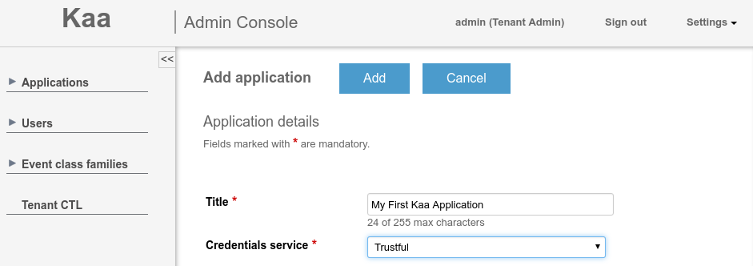
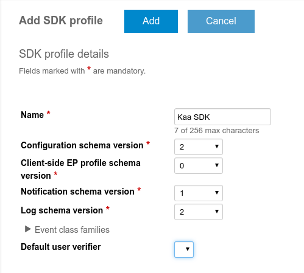
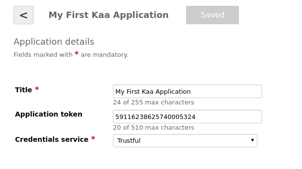



* TOC
{:toc}

By walking through this guide, you will learn essential skills of creating Kaa-based applications, as well as the understanding of the Kaa approach in general.
We'll cover here basic yet realistic example of collecting data from the sensor devices.
For more advanced Kaa features, refer to the [next steps section](#next-steps).

# Prerequisites

To register a new application within a fresh Kaa server installation, you need to create users with the [tenant administrator]({{root_url}}/Administration-guide/Tenants-and-applications-management/#tenant-admin) and [tenant developer]({{root_url}}/Administration-guide/Tenants-and-applications-management/#tenant-developer) roles.

The tenant administrator is responsible for creating new applications in Kaa, and the tenant developer configures and generates SDKs for those applications.
We suggest you to use Kaa Sandbox, which has a tenant administrator and tenant developer users already created.

# Application description

Application created trough this guide covers the basic case of collecting temperature data from a sensor.
Usually, simple sensors stream data at a constant rate, no matter what.
However, rising demand for mobility and power efficiency dictates own rules of the game.
It is not viable to keep sensors streaming all the time, especially if data is not required at this moment.
That's a point where we can save power by configuring sample period.

To satisfy application requirements, two main Kaa features are used:

- **Data Collection** feature allows sending data from endpoints to the Kaa server.
In this example, Data Collection is used to transmit temperature samples from the sensor to the Kaa reliably.

- **Configuration** feature allows broadcasting configuration parameters from the Kaa server to Kaa endpoints.
In this guide, Configuration is used to pass a sample period of the temperature to the endpoint.

# Adding application

To add an application, proceed as follows:

1. Open the [Kaa admin UI in your browser](http://127.0.0.1:9080) and log in as a tenant administrator (by default the user/password is `admin/admin123` in sandbox; use the correct credentials if you changed the default).
1. Select **Applications** on the navigation panel on the left side and, in the Applications window that opens, click **Add application**.
1. In the Add application window, enter the application name and then click **Add**.
For this guide, we use **Trustful** credential service, and our application is named "My First Kaa Application."

    

After the application has been added, you may log out.
We will not use the tenant administrator role in this guide anymore.

# Creating schemas

The application that was created in [the previous step](#adding-application) already includes the default versions of the profile, configuration, notification, and log schemes ready for use.
However, in this sample application, we use a custom data collection and configuration schemes for demonstration purposes.

To create and upload the schemas, proceed as follows:

1. Create the `data-schema.json` file on your PC with the following schema definition:

        {
            "type": "record",
            "name": "DataCollection",
            "namespace": "org.kaaproject.kaa.schema.sample",
            "fields": [
                {
                    "name": "temperature",
                    "type": "int"
                }
            ]
        }
1. Create the `configuration-schema.json` file and add the following schema:

        {
            "type": "record",
            "name": "Configuration",
            "namespace": "org.kaaproject.kaa.schema.sample",
            "fields": [
                {
                    "name": "samplePeriod",
                    "type": "int",
                    "by_default": "1"
                }
            ]
        }

    `by_default` field defines the default value for the sampling period, which is in our example
    is set to 1 second.
1. Open the [admin UI]({{root_url}}Administration-guide/Tenants-and-applications-management) in your browser and log in as a tenant developer (default user/password in the sandbox: `devuser`/`devuser123`; use the correct credentials if you changed the default).
1. Open the relevant **Log schemas** window (**Applications => My First Kaa Application => Schemas => Log**) and click **Add schema**.
1. In the **Add log schema** window, enter the name and description of the new data collection schema.

    
1. Scroll down and use the **Upload from file** function to find the previously created `data-schema.json` file with the schema.
Alternatively, you can use the [Schema Avro UI]({{root_url}}/Administration-guide/Tenants-and-applications-management/#avro-ui-forms) form to create the schema.
1. Click **Upload**.
1. Click **Add** at the top of the window.
1. Repeat uploading and adding for the configuration schema (`configuration-schema.json`) scheme:

    

As a result of these operations, you will see configuration and data collection schemas in the list.
Note that every time you add a new schema, Kaa assigns a new version number to it.
So if you already added your schemas then versions you can observe could be different from that provided on the screenshots.


In this screenshot, version 2 is log and configuration schema version that was just created. We use this version for the SDK generation later.

# Log appenders setup

It is required to setup **Log Appender** to use Data Collection feature.
In this example, we use MongoDB log appender.
Refer to [Admin UI section describing how to setup it]({{root_url}}/Administration-guide/Tenants-and-applications-management/#mongodb-log-appender).

# Generating SDK

To generate an SDK for the new application, proceed as below:

1. Select **My First Kaa Application** application and click **Generate SDK**.

    
1. Click **Add SDK profile**.

    
1. In the **Add SDK profile** window, fill in the fields as shown.
Note that schema versions that are used in the following screenshot correspond
to versions that were previously assigned by the Kaa during [the creating schemas step](#creating-schemas).
If you are using your additional schemas, version numbers may be different.
After picking correct versions for schemas used in SDK click **Add**.

    
1. Now the SDK is configured and ready to be generated. Click **Generate SDK** for corresponding SDK profile.
In the **Generate SDK** window select the target platform for your SDK and click Generate SDK.

    

    

After the SDK is generated, you will be presented with a window asking you to save it.
Specify the file name and location on your computer and then click **Save**.
The SDK is now downloaded to your computer.

Note that in this example we are generating the SDK based on the default profile and notification schemas.
These schemas are automatically populated during the creation of the application.
If necessary, you can overwrite them using [Admin UI]({{root_url}}/Administration-guide/Tenants-and-applications-management/).

# Sample client application

Once you have downloaded the SDK, you can use it in your sample project.
The following code block illustrates a simple desktop application that sends virtual temperature data from the Kaa endpoint with required configuration.

## Preparation

<ul class="nav nav-tabs">
  <li class="active"><a data-toggle="tab" href="#prep-c">C SDK</a></li>
  <li><a data-toggle="tab" href="#prep-c++">C++ SDK</a></li>
  <li><a data-toggle="tab" href="#prep-java">Java SDK</a></li>
  <li><a data-toggle="tab" href="#prep-obj-c">Objective-C</a></li>
</ul>

<div class="tab-content">

<div id="prep-c" class="tab-pane fade in active" markdown="1" >

Before you start with C application code, some preparation is required.

1. Install dependencies: CMake and OpenSSL. On Ubuntu, you can install it using following commands.

        sudo apt-get install cmake
        sudo apt-get install libssl-dev
1. Create `kaa` directory and unpack C SDK
1. Create `CMakeLists.txt` in the application directory with following contents.

        cmake_minimum_required(VERSION 2.8.8)
        project(kaa-application C)

        find_package(OpenSSL REQUIRED)

        set(CMAKE_C_FLAGS "${CMAKE_C_FLAGS} -std=gnu99 -g -Wall -Wextra")

        add_subdirectory(kaa)

        add_executable(kaa-app main.c)
        target_link_libraries(kaa-app kaac crypto)
1. Create source file `main.c` with empty main routine (for now).

        int main(void)
        {

        }
1. Validate that build system works as expected by triggering a build.

        mkdir build
        cd build
        cmake ..
        make
1. Check that demo application executable is present in the build directory.

        $ ls -l kaa-app
        -rwxr-xr-x 1 user 53944 Jun 10 12:36 kaa-app

</div>

<div id="prep-c++" class="tab-pane fade" markdown="1" >

</div>

<div id="prep-java" class="tab-pane fade" markdown="1" >

</div>

<div id="prep-obj-c" class="tab-pane fade" markdown="1" >

Before using the Objective-C application code, be sure to complete the following steps:

1. Install CocoaPods.
2. Extract Kaa SDK, open a terminal from the extraction directory, and run the following command.

        sh build.sh compile
3. Go to xCode and choose a template of the iOS Single View Application.
Name it "My First Kaa Application", choose Objective-C language and leave all other fields unchanged.
4. Link the SDK to your project as described in [Objective-C SDK Reference]({{root_url}}client-objective-c/latest/index.html?src=contextnav").
5. Make sure that your application builds successfully.
6. Replace code in the ViewController.m file with the code from the [Application code](#application-code) section.

</div>

</div>


## Application code

Now it is time to write application code that will send temperature data with the configured sampling period.

<ul class="nav nav-tabs">
  <li class="active"><a data-toggle="tab" href="#app-c">C SDK</a></li>
  <li><a data-toggle="tab" href="#app-c++">C++ SDK</a></li>
  <li><a data-toggle="tab" href="#app-java">Java SDK</a></li>
  <li><a data-toggle="tab" href="#app-obj-c">Objective-C</a></li>
</ul>

<div class="tab-content">
<div id="#app-obj-c" class="tab-pane fade in active" markdown="1" >


</div>

<div class="tab-content">
<div id="app-c" class="tab-pane fade in active" markdown="1" >

```c
#include <stdio.h>
#include <stdlib.h>
#include <stdint.h>
#include <time.h>

#include <kaa/kaa.h>
#include <kaa/platform/kaa_client.h>
#include <kaa/kaa_error.h>
#include <kaa/kaa_configuration_manager.h>
#include <kaa/kaa_logging.h>
#include <kaa/gen/kaa_logging_gen.h>
#include <kaa/platform/kaa_client.h>
#include <utilities/kaa_log.h>
#include <kaa/platform-impl/common/ext_log_upload_strategies.h>

static int32_t sample_period;
static time_t  last_sample_time;

extern kaa_error_t ext_unlimited_log_storage_create(void **log_storage_context_p, kaa_logger_t *logger);

/* Retrieves current temperature. */
static int32_t get_temperature_sample(void)
{
    /* For sake of example random data is used */
    return rand() % 10 + 25;
}

/* Periodically called by Kaa SDK. */
static void example_callback(void *context)
{
    time_t current_time = time(NULL);

    /* Respect sample period */
    if (difftime(current_time, last_sample_time) >= sample_period) {
        int32_t temperature = get_temperature_sample();

        printf("Sampled temperature: %i\n", temperature);
        last_sample_time = current_time;

        kaa_user_log_record_t *log_record = kaa_logging_data_collection_create();
        log_record->temperature = temperature;

        kaa_logging_add_record(kaa_client_get_context(context)->log_collector, log_record, NULL);
    }
}

/* Receives new configuration data. */
static kaa_error_t on_configuration_updated(void *context, const kaa_root_configuration_t *conf)
{
    (void) context;

    printf("Received configuration data. New sample period: %i seconds\n", conf->sample_period);
    sample_period = conf->sample_period;

    return KAA_ERR_NONE;
}

int main(void)
{
    /* Init random generator used to generate temperature */
    srand(time(NULL));

    /* Prepare Kaa client. */

    kaa_client_t *kaa_client = NULL;
    kaa_error_t error = kaa_client_create(&kaa_client, NULL);
    if (error) {
        return EXIT_FAILURE;
    }

    /* Configure notification manager. */

    kaa_configuration_root_receiver_t receiver = {
        .context = NULL,
        .on_configuration_updated = on_configuration_updated
    };

    error = kaa_configuration_manager_set_root_receiver(
        kaa_client_get_context(kaa_client)->configuration_manager,
        &receiver);

    if (error) {
        return EXIT_FAILURE;
    }

    /* Obtain default configuration, shipped within SDK. */

    const kaa_root_configuration_t *dflt = kaa_configuration_manager_get_configuration(
        kaa_client_get_context(kaa_client)->configuration_manager);

    printf("Default sample period: %i seconds\n", dflt->sample_period);

    /* Configure data collection. */

    void *log_storage_context         = NULL;
    void *log_upload_strategy_context = NULL;

    /* The internal memory log storage distributed with Kaa SDK. */
    error = ext_unlimited_log_storage_create(&log_storage_context,
        kaa_client_get_context(kaa_client)->logger);

    if (error) {
        return EXIT_FAILURE;
    }

    /* Create a strategy based on timeout. */
    error = ext_log_upload_strategy_create(
        kaa_client_get_context(kaa_client), &log_upload_strategy_context,
        KAA_LOG_UPLOAD_BY_TIMEOUT_STRATEGY);

    if (error) {
        return EXIT_FAILURE;
    }

    /* Strategy will upload logs every 5 seconds. */
    error = ext_log_upload_strategy_set_upload_timeout(log_upload_strategy_context, 5);

    if (error) {
        return EXIT_FAILURE;
    }

    /* Specify log bucket size constraints. */
    kaa_log_bucket_constraints_t bucket_sizes = {
         .max_bucket_size       = 32,   /* Bucket size in bytes. */
         .max_bucket_log_count  = 2,    /* Maximum log count in one bucket. */
    };

    /* Initialize the log storage and strategy (by default it is not set). */
    error = kaa_logging_init(kaa_client_get_context(kaa_client)->log_collector,
        log_storage_context, log_upload_strategy_context, &bucket_sizes);

    if (error) {
        return EXIT_FAILURE;
    }

    /* Start Kaa SDK's main loop. example_callback is called once per second. */

    error = kaa_client_start(kaa_client, example_callback, kaa_client, 1);

    /* Should get here only after Kaa stop. */

    kaa_client_destroy(kaa_client);

    if (error) {
        return EXIT_FAILURE;
    }

    return EXIT_SUCCESS;
}

```

</div>

<div id="app-c++" class="tab-pane fade" markdown="1" >

</div>

<div id="app-java" class="tab-pane fade" markdown="1" >

</div>

<div id="app-obj-c" class="tab-pane fade" markdown="1" >

```objc
#import "ViewController.h"

@import Kaa;

@interface ViewController () <KaaClientStateDelegate, ConfigurationDelegate, ProfileContainer>

@property (nonatomic, strong) id<KaaClient> kaaClient;
@property (nonatomic, weak) NSTimer *samplingTimer;

@end

static const NSInteger defaultSamplePeriod = 1;

@implementation ViewController

- (void)viewDidLoad {
    [super viewDidLoad];

    NSLog(@"Your first application started");

    // Create a Kaa client and add a listener which displays the Kaa client status
    // as soon as the Kaa client is started.
    self.kaaClient = [KaaClientFactory clientWithStateDelegate:self];
    
    // Configure log uploading strategy so that logs are uploaded upon adding a new log. Set maximum parallel log uploads to 1.
    RecordCountLogUploadStrategy *logUploadStrategy = [[RecordCountLogUploadStrategy alloc] initWithCountThreshold:1];
    logUploadStrategy.maxParallelUploads = 1;
    [self.kaaClient setLogUploadStrategy:logUploadStrategy];
    
    
    NSArray *paths = NSSearchPathForDirectoriesInDomains(NSDocumentDirectory, NSUserDomainMask, YES);
    NSString *configurationPath = [[paths objectAtIndex:0] stringByAppendingPathComponent:@"savedconfig.cfg"];

    // Persist configuration in a local storage to avoid downloading it each time the Kaa client is started.
    [self.kaaClient setConfigurationStorage:[SimpleConfigurationStorage storageWithPath:configurationPath]];
    
    // Add a delegate which displays the Kaa client configuration each time it is updated.
    [self.kaaClient addConfigurationDelegate:self];
    
    // Add a delegate which returns Kaa profile upon request.
    [self.kaaClient setProfileContainer:self];
    
    // Start the Kaa client and connect it to the Kaa server.
    [self.kaaClient start];
}

#pragma mark - Supporting methods

/**
 * Schedules new timer each time when sample period was updated.
 */

- (void)createSamplingTimerWithInterval:(NSInteger)period {
    if (self.samplingTimer) {
        [self.samplingTimer invalidate];
    }
    if (period >= 0) {
        if (period == 0) {
            self.samplingTimer = [NSTimer scheduledTimerWithTimeInterval:defaultSamplePeriod target:self selector:@selector(generateTemperature) userInfo:nil repeats:YES];
        }
        self.samplingTimer = [NSTimer scheduledTimerWithTimeInterval:period target:self selector:@selector(generateTemperature) userInfo:nil repeats:YES];
    }
}

/**
 * Used to simulate getting data from temperature sensor. Generates random numbers from 20 to 35.
 */

- (void)generateTemperature {
    NSInteger upperTemperatureLimit = 35;
    NSInteger lowerTemperatureLimit = 20;
    NSInteger temperature = arc4random()%(upperTemperatureLimit - lowerTemperatureLimit) + lowerTemperatureLimit;
    NSLog(@"Sampled temperature: %ld", temperature);
    [self.kaaClient addLogRecord:[[KAADataCollection alloc] initWithTemperature:(int32_t)temperature]];
}

#pragma mark - Delegate methods

- (void)onStarted {
    NSLog(@"Kaa client started");
    [self displayConfiguration];
}

- (void)onStopped {
    NSLog(@"Kaa client stopped");
}

- (void)onStartFailureWithException:(NSException *)exception {
    NSLog(@"START FAILURE: %@ : %@", exception.name, exception.reason);
}

- (void)onPaused {
    NSLog(@"Client paused");
}

- (void)onPauseFailureWithException:(NSException *)exception {
    NSLog(@"PAUSE FAILURE: %@ : %@", exception.name, exception.reason);
}

- (void)onResume {
    NSLog(@"Client resumed");
}

- (void)onResumeFailureWithException:(NSException *)exception {
    NSLog(@"RESUME FAILURE: %@ : %@", exception.name, exception.reason);
}

- (void)onStopFailureWithException:(NSException *)exception {
    NSLog(@"STOP FAILURE: %@ : %@", exception.name, exception.reason);
}

- (KAAEmptyData *)getProfile {
    return [[KAAEmptyData alloc] init];
}

- (void)onConfigurationUpdate:(KAAConfiguration *)configuration {
    NSLog(@"Configuration was updated");
    [self displayConfiguration];
}

- (void)displayConfiguration {
    KAAConfiguration *configuration = [self.kaaClient getConfiguration];
    if (configuration.samplePeriod >= 0) {
        NSInteger samplePeriod = defaultSamplePeriod;
        if (configuration.samplePeriod > 0) {
            samplePeriod = configuration.samplePeriod;
        }
        NSLog(@"Now sample period is %ld", (long)samplePeriod);
        dispatch_async(dispatch_get_main_queue(), ^{
            [self createSamplingTimerWithInterval:samplePeriod];
        });
    } else {
        NSLog(@"Incorrect sample period. It must be > 0");
    }
}

@end
```

</div>

</div>

## Launching application

<ul class="nav nav-tabs">
  <li class="active"><a data-toggle="tab" href="#run-c">C SDK</a></li>
  <li><a data-toggle="tab" href="#run-c++">C++ SDK</a></li>
  <li><a data-toggle="tab" href="#run-java">Java SDK</a></li>
  <li><a data-toggle="tab" href="#run-obj-c">Objective-C</a></li>
</ul>

<div class="tab-content">
<div id="run-c" class="tab-pane fade in active" markdown="1" >

To launch C application next steps should be performed.

1. Rebuild application with decreased log level. That reduces a mess that can appear when debug logs are enabled.

        cd build
        cmake -DKAA_MAX_LOG_LEVEL=3 ..
        make

2. Launch the executable file.

        ./kaa-app

</div>

<div id="run-c++" class="tab-pane fade" markdown="1" >

</div>

<div id="run-java" class="tab-pane fade" markdown="1" >

</div>

<div id="run-obj-c" class="tab-pane fade" markdown="1" >

To launch your Objective-C application:

1. Select **My First Kaa Application** as target.
2. Click **Play**.

</div>

</div>


## Expected output

After application starts, following logs will appear on the console.

```
Default sample period: 1 seconds
Sampled temperature: 32
Sampled temperature: 26
Sampled temperature: 26
Sampled temperature: 31
Sampled temperature: 28
Sampled temperature: 28
```
Note that temperature value must be sampled once per second as stated in the configuration scheme.
Refer to the [Troubleshooting](#troubleshooting) section if something goes wrong.

## Retrieving collected data

To obtain temperature data stored on the server, following steps should be performed.

1. Grab application token. It is a token that you can copy from the main window
    of the application the Administration UI.

    
1. Login to your machine running Kaa server (in case you are using sandbox,
    default username and password are `kaa`/`kaa`).
1. Start MongoDB shell

        mongo kaa
1. Fetch data using application token retrieved at the first step within this section.

        db.logs_$your_application_token$.find()

## Changing sample period

Let's check how to tune sampling period on a server and see what happens on the endpoint.

1. Make sure your client application is running and sampling temperature
1. Login to the **Admin UI** as a Tenant Developer and proceed to the **Endpoint Groups**
    section of your application.

    
1. Click on the endpoint group **All** and select configuration schema from **Configurations** section.

    
1. Click on the latest **Configuration schema** and activate **Draft** tab.
Change sample period to, say, 5 seconds and hit **Save** button.

    
1. Now, activate a draft by clicking **Activate** button and see client output.

        Sampled temperature: 32
        Sampled temperature: 26
        Sampled temperature: 29
        Sampled temperature: 33
        Sampled temperature: 26
        Received configuration data. New sample period: 5
        Sampled temperature: 33
        Sampled temperature: 30
        Sampled temperature: 34
        Sampled temperature: 25

    You notice that sampling period is  equal to the new
    sample period we set in **Admin UI**.


# Further reading

To create a real-world IoT solution, you need to add more features into your application.

Kaa provides many ones you might need.
Follow the links below to grasp the scope of Kaa capabilities as well as get familiar with the essential documentation, such as Programming guide and Administration UI guide.

 - [Key Kaa features]({{root_url}}/Programming-guide/Key-platform-features/)

    Learn about Kaa features and capabilities.

 - [Using endpoint SDKs]({{root_url}}/Programming-guide/Using-Kaa-endpoint-SDKs/)

    Create advanced applications using Kaa SDKs.

 - [Administration UI guide]({{root_url}}/Administration-guide/)

    Learn how to install, configure and manage Kaa platform in details.

 - [Contribute to Kaa]({{root_url}}/Customization-guide/How-to-contribute/)

    Learn how to contribute to the Kaa project.
