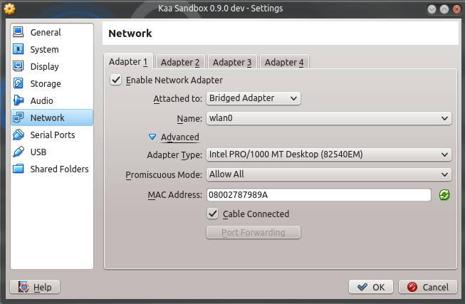
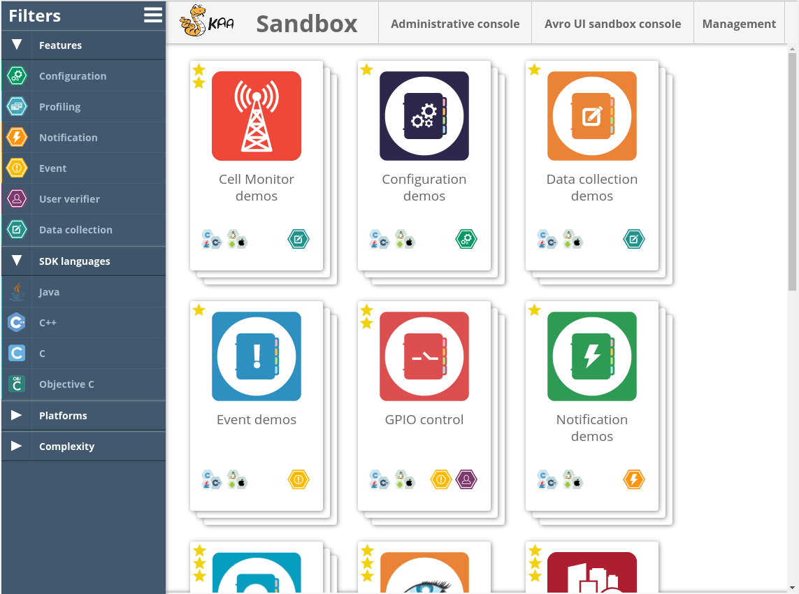
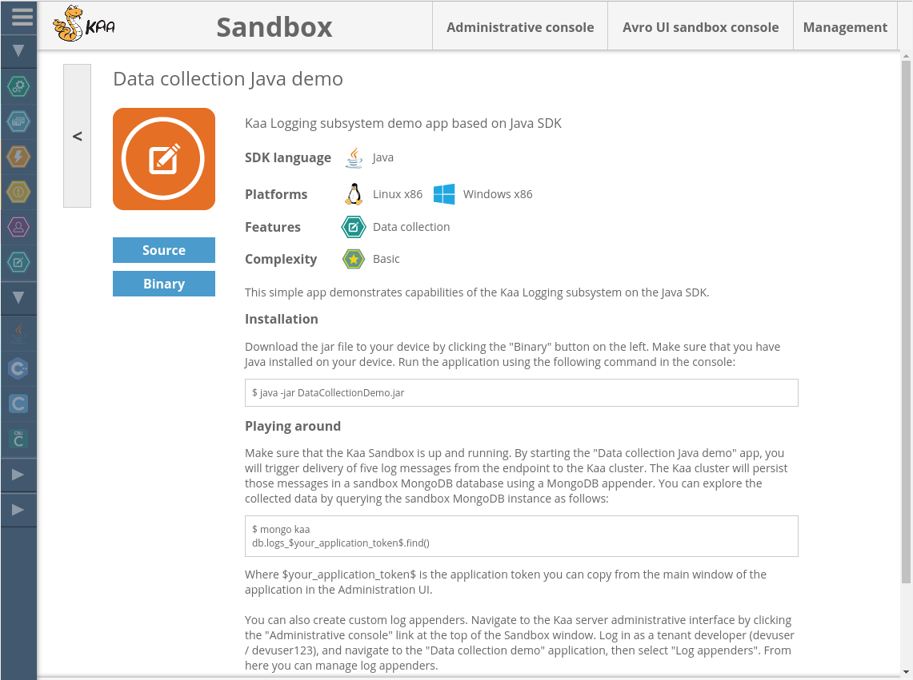


 /{{root_url[1]}}/{{root_url[2]}}/

* TOC
{:toc}


*Kaa Sandbox* is a pre-configured virtual environment specifically designed for speeding up the setup of your private Kaa platform instance for educational, development, and proof-of-concept purposes.
The Sandbox also includes a selection of demo applications that illustrate various aspects of the platform functionality.

This page provides guidance on how to set up Sandbox and run your first Kaa application that will work with the Kaa platform.
You are also welcome to follow the below video tutorial that will walk you through the Kaa Sandbox set up.

<p align="center">
  <iframe width="800" height="500" src="https://www.youtube.com/embed/ynbxcRdgXFU">
  </iframe>
</p>


# Installation steps

The Kaa Sandbox can either be run in your local VirtualBox environment, or launched directly on AWS Elastic Compute Cloud (EC2).

<ul class="nav nav-tabs">
  <li class="active"><a data-toggle="tab" href="#VirtualBox">VirtualBox</a></li>
  <li><a data-toggle="tab" href="#EC2">EC2</a></li>
</ul>

<div class="tab-content">

<div id="VirtualBox" class="tab-pane fade in active" markdown="1">

<br>

To run the Kaa Sandbox, your system must meet the following minimum requirements:

- 64-bit OS
- 4 GB RAM
- Virtualization enabled in BIOS

To install Kaa Sandbox, perform the following steps:

1. Install the virtualization environment.
The current version of Kaa Sandbox supports Oracle VirtualBox 4.2+, which is available as a [free download](https://www.virtualbox.org/wiki/Downloads).

2. Download the Sandbox .ova image from the [Kaa download page](http://www.kaaproject.org/download-kaa/).

3. Import the Sandbox image using [this guide](https://www.virtualbox.org/manual/ch01.html#ovf).

4. Once the image has loaded, open the machine settings, select the `System` tab, and adjust the amount of RAM and processors available to the VM.
For optimal performance we recommend at least 4 GB of RAM, and at least 2 CPUs.

5. *\[Optional\]* The default VM networking configuration is NAT.
In this configuration you will only be able to connect to the Kaa server from your host machine.
That includes the Kaa client applications, which will only be able to reach your Sandbox server from the host machine.

   Should you wish to deploy client applications to any hardware other than your host machine, or access Kaa web interfaces from your networked devices, the networking mode should be changed to `Bridged Adapter`.
To configure the networking mode, switch to the `Network` tab in the VM settings.
Make sure you change the `Promiscuous Mode` to `Allow All` under the `Advanced` spoiler.

   

6. Apply the VM settings and start the virtual machine.

7. Wait until the machine boots up completely and open **127.0.0.1:9080/sandbox** URL in your browser.
(If you changed the networking mode to Bridged Adapter, you should rather use **<host\_machine\_ip>:9080/sandbox**.)

<br>

</div><div id="EC2" class="tab-pane fade" markdown="1">

<br>

> **NOTE:** By running your Kaa Sandbox instance on AWS EC2 you may incur the associated charges.
> Make sure you have reviewed and understood the current EC2 charging plans before proceeding with the installation.

To launch the Kaa Sandbox on AWS EC2, do the following:

1. EC2 offers a number of [geographic regions](http://docs.aws.amazon.com/AWSEC2/latest/UserGuide/using-regions-availability-zones.html) for launching the AMI.
Factors for choosing a region may include latency, cost, or regulatory requirements.
To launch Kaa Sandbox in your preferred region, please use the [Kaa download page](http://www.kaaproject.org/download-kaa/).

2. At the `Choose an Instance Type` step, choose the appropriate instance type.
For optimal performance we recommended that you use at least _m3.large_, or more powerful.

3. At the `Configure Instance Details` step, change values in the fields as appropriate or leave default values.

4. At the `Add Storage` step, add additional volumes as appropriate.
The number of instance store devices available on the machine depends on the instance type.
EBS volumes are not recommended for the database storage.

5. At the `Tag Instance` step, give a name to your instance, for example, `kaa-sandbox-0.10.0`.

6. At the `Configure Security Group` step, select one of the following options:

   - Create a new security group with the inbound open ports:

      | Protocol | Port | RangeSource|
      |----------|------|------------|
      | TCP      | 22   | 0.0.0.0/0  |
      | TCP      | 8080 | 0.0.0.0/0  |
      | TCP      | 9999 | 0.0.0.0/0  |
      | TCP      | 9998 | 0.0.0.0/0  |
      | TCP      | 9997 | 0.0.0.0/0  |
      | TCP      | 9889 | 0.0.0.0/0  |
      | TCP      | 9888 | 0.0.0.0/0  |
      | TCP      | 9887 | 0.0.0.0/0  |
      | TCP      | 9080 | 0.0.0.0/0  |

   - Select the previously created security group, configured as explained above.

7. At the `Review Instance Launch` step, make any changes as appropriate.

8. Click `Launch` and then in the `Select an existing key pair` or `Create a new key pair` dialog, do one of the following:

   - Select an existing key pair from the the `Select a key pair` drop list.
   - If you need to create a new key pair, click `Create a new key pair`.
   Then create the new key pair as described in [Creating a key pair](http://docs.aws.amazon.com/gettingstarted/latest/wah/getting-started-prereq.html).

9. Click `Launch Instances`.
The `Launch Status` page will be displayed.

10. Click `View Instances`.

11. After launching Kaa Sandbox instance, go to **<your\_instance\_public\_domain\_name\>:9080/sandbox** or **<your\_instance\_public\_ip\>:9080/sandbox** URL.
Public DNS or IP of your instance are available from your instance description.

<br>

</div></div>

# Launching your first Kaa application

Now that you have your Kaa Sandbox instance up and running, let's run a sample application!

Kaa *Sandbox web UI* listens on port 9080 (by default) and provides you with access to [sample applications](https://github.com/kaaproject/sample-apps) and some basic Sandbox configuration capabilities.

You can download the source code of every sample application.
Java- and Android-based sample applications can also be downloaded as ready to run .jar or .apk files respectively.
As you request source or executable files, the Sandbox will generate and embed into your download an [Endpoint SDK library]({{root_url}}Programming-guide/Using-Kaa-endpoint-SDKs/) configured to work with your specific Kaa server instance.

<br>



To download and run your first Kaa sample application, we suggest that you navigate to the `Data collection demos` application bundle and select the sample app programming language of your preference.
If you want to avoid setting up the toolchain and rather want to see Kaa platform in action with minimum further setup, it is recommended that you choose Java language, for which the Sandbox will be able to provide you with a ready to launch executable .jar file.
Follow the instructions in the Sandbox to download, run, and test the sample application.

<br>



<br>

# What's next?

After you get acquainted with Kaa Sandbox and its demo applications, you can take one step further and create your own Kaa application!
We encourage you to follow this step by step guide for creating [your first Kaa application]({{root_url}}Programming-guide/Your-first-Kaa-application) from scratch.

Please note that Kaa Sandbox is not intended for production use, and taking your applications live will require the installation of Kaa platform into your environment.
Kaa installation can be performed in the single node mode or in the distributed mode, as described in the [installation guide]({{root_url}}Administration-guide/System-installation).

Make sure to review the [Troubleshooting guide]({{root_url}}Administration-guide/Troubleshooting/) if you happen to run into any issues.

## Administrative UI

You can access Kaa Administrative UI by clicking the `Administrative console` at the top of the page.

> **NOTE:** Kaa Sandbox comes with several pre-configured user accounts as listed below:
>
> | Account type          | Username | Default password |
> |-----------------------|----------|------------------|
> | Kaa admininstrator    | kaa      | kaa123           |
> | Tenant admininstrator | admin    | admin123         |
> | Tenant developer      | devuser  | devuser123       |

## Avro UI sandbox console

The *Avro UI sandbox console* is an advanced tool for designing and modifying the data schemes and records used in Kaa.
You can access it by clicking the corresponding link in the Sandbox web UI header.

## Advanced Sandbox configuration

### Outgoing email settings

Kaa uses an outgoing email server to send newly created users emails with the information about their passwords, as well as other notifications.
By default, the server settings are not configured in the Sandbox.
Refer to the [guide on configuring the outgoing email server settings]({{root_url}}Administration-guide/Tenants-and-applications-management#configuring-outgoing-mail-settings) for instructions on how to set up this functionality in your Kaa Sandbox.

### Networking

You can control the host/IP the Kaa components bind to by setting the desired address either via the Sandbox UI, or via the console.
The same address will be configured into Kaa Endpoint SDK libraries generated by your server instance, so that Kaa clients know where to connect to.

<ul class="nav nav-tabs">
  <li class="active"><a data-toggle="tab" href="#Sandbox-web-ui">Sandbox web UI</a></li>
  <li><a data-toggle="tab" href="#Console">Console</a></li>
</ul>

<div class="tab-content">

<div id="Sandbox-web-ui" class="tab-pane fade in active" markdown="1">

<br>

Navigate to the `Management` page by clicking a link in the upper right corner of the Sandbox web UI.
Input the desired address in the `Kaa host/IP` section and click the "Update" button.

<br>


</div><div id="Console" class="tab-pane fade" markdown="1">

<br>

Log into the Sandbox VM terminal and use the following script:

```sh
/usr/lib/kaa-sandbox/bin/change_kaa_host.sh <new host name/ip>
```

<br>

</div></div>

# Further reading

Use the following guides and references to make the most of Kaa.

| Guide | What it is for |
|-------|----------------|
| **[Key platform features]({{root_url}}Programming-guide/Key-platform-features/)** | Use this reference to learn about features and capabilities of Kaa ([Endpoint profiles]({{root_url}}Programming-guide/Key-platform-features/Endpoint-profiles/), [Events]({{root_url}}Programming-guide/Key-platform-features/Events/), [Notifications]({{root_url}}Programming-guide/Key-platform-features/Notifications/), [Logging]({{root_url}}Programming-guide/Key-platform-features/Data-collection/), and other features). |
| **[Installation guide]({{root_url}}Administration-guide/System-installation)** | Use this guide to install and configure Kaa either on a single Linux node or in a cluster environment. |
| **[Contribute To Kaa]({{root_url}}Customization-guide/How-to-contribute/)** | Use this guide to learn how to contribute to Kaa project and which code/documentation style conventions we adhere to. |

---
