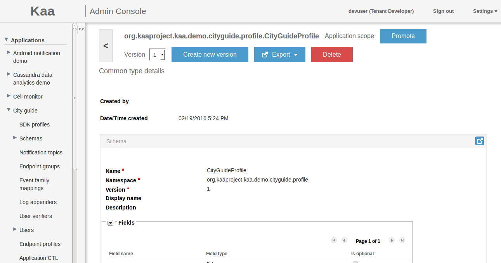
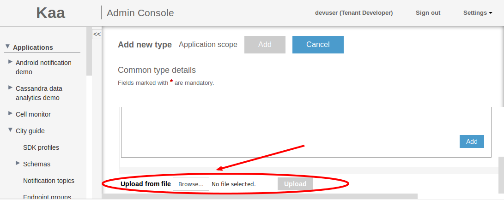
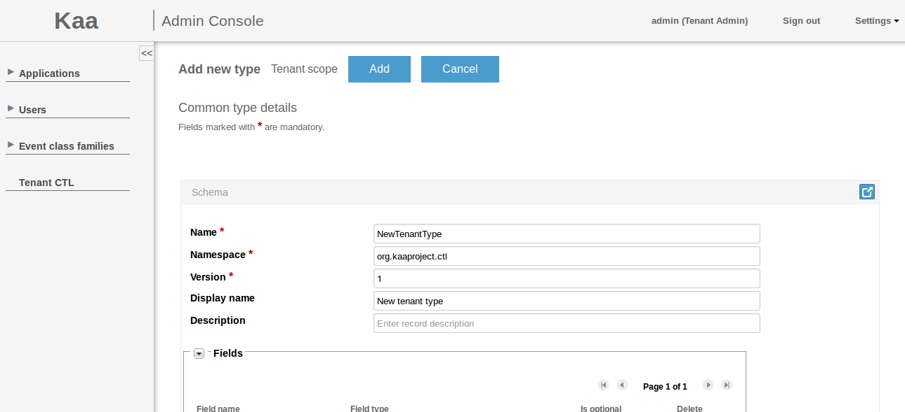



* TOC
{:toc}

The [Common type library (CTL)]({{root_url}}Glossary/#common-type-library-ctl) is a repository of data type schemas used for all Kaa modules.
As more schema types and versions are created, they are recorded in the CTL for future use.

[Common type (CT)]({{root_url}}Glossary/#common-type-ct) is a CTL unit representing a set of data type schema versions.
Using CTL allows for consistent schema management within a [Kaa instance]({{root_url}}Glossary/#kaa-instance-kaa-deployment).

## CT definitions and FQNs

Schemas used in Kaa are based on the [Apache Avro](http://avro.apache.org) format.
Every CT is identified by **Fully qualified name (FQN)**.
FQN is a combination of namespace and name attributes defined in the root Avro record of a CT schema.
Each CT contains a set of CT schemas with the same FQN and different versions.
A CT schema ID is the combination of the schema FQN and version.
Any CT schema ID is unique across the CT.
After a CT schema is created, it becomes unmodifiable and can only be deleted.

## CT schema versioning and dependencies

A CT schema version must be explicitly defined in the CT schema as shown below.

```json
{
    "type":"record",
    "name":"SampleCT",
    "namespace":"org.kaaproject.sample",
    "version":1,
    "dependencies":[
        {
            "fqn":"org.kaaproject.sample.ReferencedCT",
            "version":2
        }
    ],
    "fields":[
        ...
    ]
}
```

Attempting to load a CT schema with no version or with a used version will result in an error.
A CT schema can have dependencies on other CT schemas.
CT schema dependencies are defined as an array of the CT schema IDs (for example, see org.kaaproject.sample.ReferencedCT schema in the code snippet above).
Deleting a CT schema is only permitted if its ID is not referenced in any other CT schema.
Cyclic dependencies are not permitted.
Thus, CT schemas are nodes in a directed acyclic graph of dependencies.

## CT scopes and visibility

CTs can be defined within these scopes: **system**, **tenant**, and **application**.
Scopes impact the visibility of CTs.
For example, a CT defined for [application]({{root_url}}Glossary/#kaa-application) A is not visible for application B.
Any FQN is unique within its CT scope.
Attempting to create a CT with an FQN that already exists in the same scope will result in an error.

>**IMPORTANT:** You can create a CT with an FQN that already exists in other scope, but this is not recommended.
>Attempting to do so will result in a warning message.
{:.important}

The expected outcomes of an attempt to create a CT with a non-unique FQN are summarized in the following table.


CT scope | System | Tenant | Application
--- | --- | --- | ---
Matching FQN at System level | error unless the version is unique | error | error
Matching FQN at Tenant level | error | error unless the version is unique | error
Matching FQN in a different Tenant | N/A | OK | OK
Matching FQN at Application level | error | error | error unless the version is unique
Matching FQN in a different Application of the same Tenant | N/A | N/A | warning in web UI; OK at services level

## CT management

You can manage CTs using the [Server REST API]({{root_url}}Programming-guide/Server-REST-APIs/#/Common_Type_Library) or the [Administration UI]({{root_url}}Glossary/#administration-ui).

### Get the list of CTs

As [Kaa administrator]({{root_url}}Glossary/#kaa-administrator), you can get the list of available system CTs using the [REST API]({{root_url}}Programming-guide/Server-REST-APIs/#!/Common_Type_Library/getSystemLevelCTLSchemas) call or by clicking **System CTL** on the **Administration UI** page.


As [Tenant administrator]({{root_url}}Glossary/#tenant-administrator), you can get the list of available Tenant CTs and System CTs using the [REST API]({{root_url}}Programming-guide/Server-REST-APIs/#!/Common_Type_Library/getTenantLevelCTLSchemas) call or by clicking **Tenant CTL** on the **Administration UI** page.
Use the **Display higher scopes** checkbox to toggle visibility of the System CTs.

As [Tenant developer]({{root_url}}Glossary/#tenant-developer), you can get the list of available Tenant CTs and System CTs in the same way as Tenant administrator.
In addition, Tenant developer can get the list of available application CTs using the [REST API]({{root_url}}Programming-guide/Server-REST-APIs/#!/Common_Type_Library/getApplicationLevelCTLSchemasByAppToken) call or by clicking **Application CTL** on the **Administration UI** page.
Use the **Display higher scopes** checkbox to toggle visibility of the system and tenant CTs.

### View CT details

To view the CT details:

- Use the [REST API]({{root_url}}Programming-guide/Server-REST-APIs/#!/Common_Type_Library/getCTLSchemaById) call.

OR

- Open the **Administration UI** page, select the corresponding CTL and click on the CT in the list.
The **Common type details** page will open.



To view another version of the CT, select it form the **Version** drop-down list.
To create a new version of the CT, click **Create new version**.

### Create a new CT

To create a new CT:

- Use the [REST API]({{root_url}}Programming-guide/Server-REST-APIs/#!/Common_Type_Library/saveCTLSchemaWithAppToken) call.

OR

- Open the **Administration UI** page, select the corresponding CTL and click the **Add new type** button.

If you want to import a schema file, click **Browse**, select a `.json` file containing your schema, click **Upload**, then click **Add**.



>**NOTE:** Kaa administrator creates new system CTs.
>Tenant administrator creates new tenant CTs.
>Tenant developer creates new application CTs.
{:.note}

In the **Add new type** window, fill in all the required fields and click **Add**.



### Delete CT schemas

To delete a schema:

- Use the [REST API]({{root_url}}Programming-guide/Server-REST-APIs/#!/Common_Type_Library/deleteCTLSchemaByFqnVersionTenantIdAndApplicationToken) call.

OR

- Open the **Common type details** page and click **Delete**.

>**NOTE:** Kaa administrator can delete system CT schemas.
>Tenant administrator can delete tenant CT schemas.
>Tenant developer can delete application CT schemas.
{:.note}

### Promote CTs

If you want some of your **Application** scope CTs to be available in the **Tenant** scope, you neeed to promote them.
To do this, you can use the [REST API]({{root_url}}Programming-guide/Server-REST-APIs/#!/Common_Type_Library/promoteScopeToTenant) call or use the **Promotion** feature:

1. Open the **Administration UI** page, unfold the **Applications** list.

2. In the sub-list of a chosen application, click **Application CTL**.

3. Click the CT to open the **Common type details** page and click **Promote**.


The CT (including all its versions) is now available in the **Tenant** scope.

>**NOTE:** You cannot promote a CT from the **Application** scope if there is a CT in the **Tenant** scope with the same FQN, or if the CT in question has dependencies on other CTs in the **Application** scope.
{:.note}

### CT schema export

To export a CT schema:

- Use the [REST API]({{root_url}}Programming-guide/Server-REST-APIs/#!/Common_Type_Library/exportCTLSchemaByAppToken) call.

OR

- On the **Common type details** page of the CT, click **Export** and select the exporting option.


There are four options for CT schema export:

* **shallow**: exports the CT schema file.
* **deep**: exports the CT schema file and a file with all referenced CTs recursively.
* **flat**: exports the CT schema file and a file with all referenced CTs inline.
* **library**: exports `.jar` archive containing the CT schema and all referenced CTs as compiled java classes.

The java library provides all necessary java structures, including the nested types, in compliance with the CT schema.
You can use these java classes in external applications.
For example, you can serialize binary log records generated by data collection process.

## Further reading
* [Apache Avro](http://avro.apache.org)
