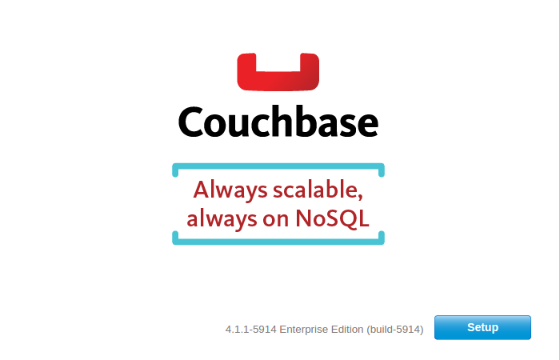
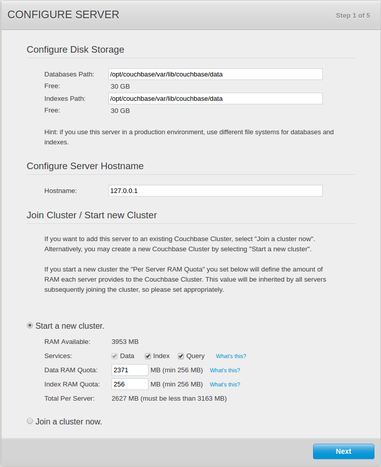
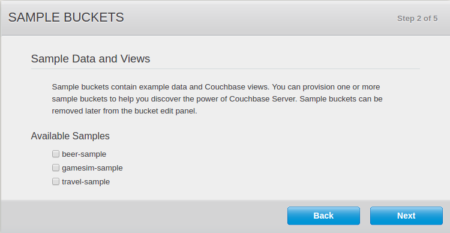
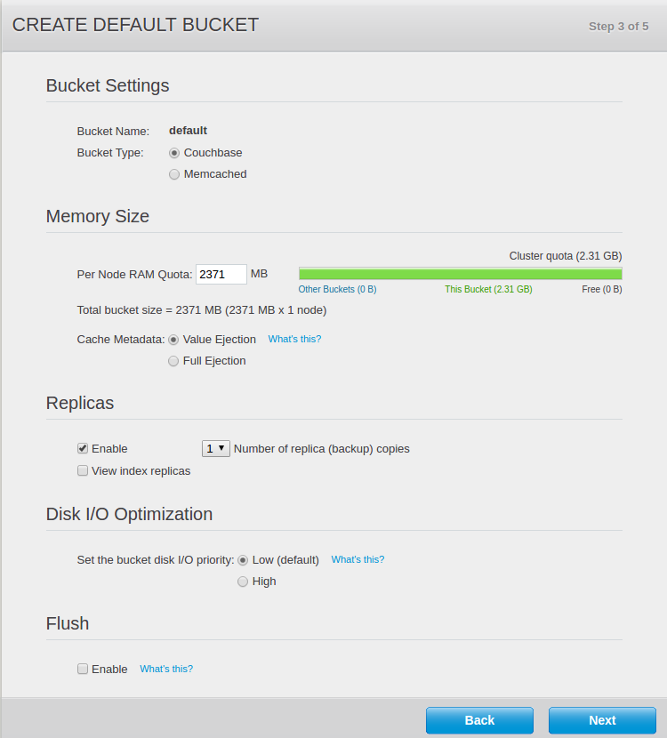
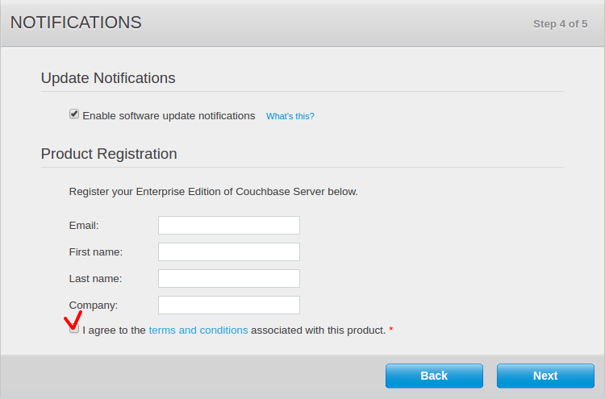
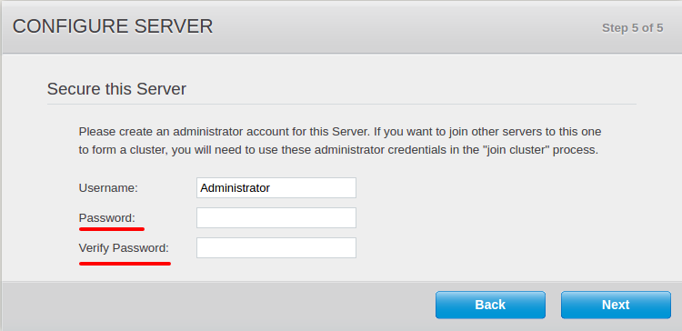
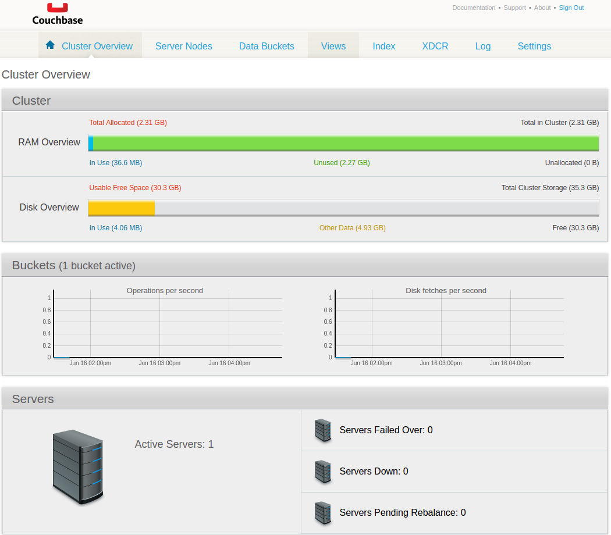
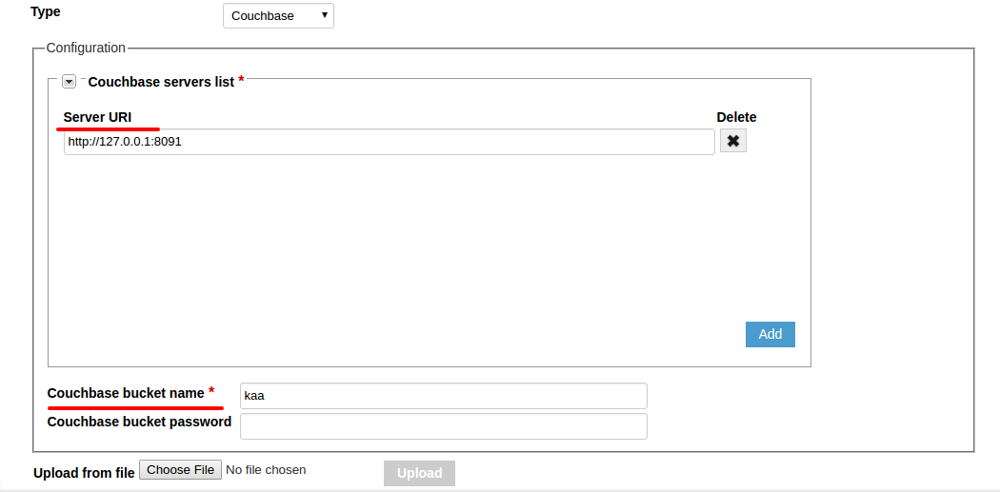
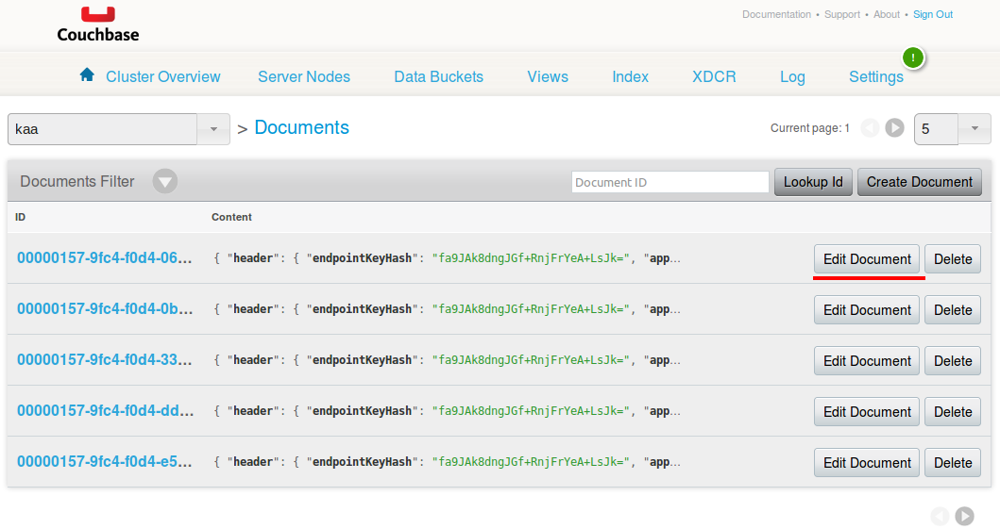



* TOC
{:toc}

The Couchbase log appender is used to transfer logs from the [Operations service]({{root_url}}Glossary/#operations-service) to the [Couchbase](http://www.couchbase.com/) database.

Each log document consists of the following fields:

* **id** -- randomly generated UUID string.
* **header** -- contains log metadata:
  * `endpointKeyHash` -- identifies the endpoint that produced the log record.
  * `applicationToken` -- [application identifier]({{root_url}}Glossary/#application-token).
  * `headerVersion` -- version of the log header, currently equals **1**.
  * `timestamp` -- timestamp in milliseconds showing when logs were uploaded to the key/value storage.
* **event** -- log body (log item, received from a client).

The values are stored as serialized generic records using record wrapper [Avro](https://avro.apache.org/) schema.

## Create Couchbase log appender

To create a Couchbase log appender for your application using the [Administration UI]({{root_url}}Glossary/#administration-ui):

1. Log in to the **Administration UI** page as a [tenant developer]({{root_url}}Glossary/#tenant-developer).

2. Click **Applications** and open the **Log appenders** page of your application.
Click **Add log appender**.

3. On the **Log appender details** page, enter the necessary information and set the **Type** field to **Couchbase**.

	

4. Fill in the **Configuration** section for your log appender and click **Add**.
See [Configure log appender](#configure-log-appender).

Alternatively, you can use the [server REST API]({{root_url}}Programming-guide/Server-REST-APIs/#!/Logging/editLogAppender) to create or edit your Couchbase log appender.

The following example illustrates how to create an instance of Cassandra log appender using the server REST API.

```bash
curl -v -S -u devuser:devuser123 -X POST -H 'Content-Type: application/json' -d @couchbaseLogAppender.json "http://localhost:8080/kaaAdmin/rest/api/logAppender" | python -mjson.tool
```
where file `couchbaseLogAppender.json` contains the following data.

```json
{
    "pluginClassName":"org.kaaproject.kaa.server.appenders.couchbase.appender.CouchbaseLogAppender",
    "pluginTypeName":"Couchbase",
    "applicationId":"5",
    "applicationToken":"82635305199158071549",
    "name":"Sample Couchbase log appender",
    "description":"Playing with Couchbase log appender",
    "headerStructure":[
        "KEYHASH",
        "VERSION",
        "TIMESTAMP",
        "TOKEN",
        "LSVERSION"
    ],
    "maxLogSchemaVersion":2147483647,
    "minLogSchemaVersion":1,
    "tenantId":"1",
    "jsonConfiguration":"{\"couchbaseServerUris\":[{\"serverUri\":\"http://127.0.0.1:8091\"}],\"bucket\":\"kaa\",\"password\":{\"string\":\"\"}}"
}
```

Below is an example result.

```json
{
    "applicationId": "5",
    "applicationToken": "82635305199158071549",
    "confirmDelivery": true,
    "createdTime": 1466071152031,
    "createdUsername": "devuser",
    "description": "Playing with Couchbase log appender",
    "headerStructure": [
        "KEYHASH",
        "VERSION",
        "TIMESTAMP",
        "TOKEN",
        "LSVERSION"
    ],
    "id": "65551",
    "jsonConfiguration": "{\"couchbaseServerUris\":[{\"serverUri\":\"http://127.0.0.1:8091\"}],\"bucket\":\"kaa\",\"password\":{\"string\":\"\"}}",
    "maxLogSchemaVersion": 2147483647,
    "minLogSchemaVersion": 1,
    "name": "Sample Couchbase log appender",
    "pluginClassName": "org.kaaproject.kaa.server.appenders.couchbase.appender.CouchbaseLogAppender",
    "pluginTypeName": "Couchbase",
    "tenantId": "1"
}
```

## Configure log appender

The Couchbase log appender configuration must match [this Avro schema]({{github_url}}server/appenders/couchbase-appender/src/main/avro/couchbase-appender-config.avsc).

Below is an example configuration that matches the mentioned Avro schema.

```json
{
    "couchbaseServerUris":[
        {
            "serverUri":"http://127.0.0.1:8091"
        }
    ],
    "bucket":"kaa",
    "password":null
}
```

## Playing with Couchbase log appender

The example below uses the **Data collection demo** from [Kaa Sandbox]({{root_url}}Glossary/#kaa-sandbox).

To play around with the the Couchbase log appender:

1. [Download and install](http://developer.couchbase.com/documentation/server/current/getting-started/installing.html#installing) Couchbase.

2. Open your browser at http://*your host name*:8091/ and click the **Setup** button.
	

3. Click **Next** on the following pages.
					

4. After you created your administrator account for the server, the **Cluster Overview** page will open.
	

5. Open Kaa Sandbox, log in to the Administration UI, and specify the URL and bucket to be used for receiving logs.
	

6. Open the Data collection demo from Kaa Sandbox, follow the application installation instructions, and run the application.

7. Go to http://*your host name*:8091, click **Data Buckets**, then click the **Documents** button of your bucket.
	

8. Because you launched the Data collection demo application before, your output should be similar to the example below.
	

9. Click **Edit Document** to access the contents of the log document.
	

If you don't get the desired output or experience other problems, see [Troubleshooting]({{root_url}}Administration-guide/Troubleshooting).
