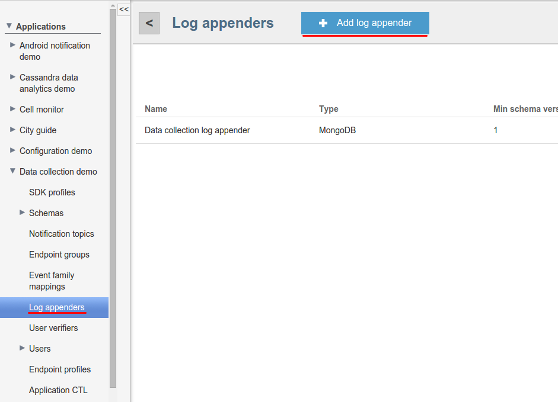
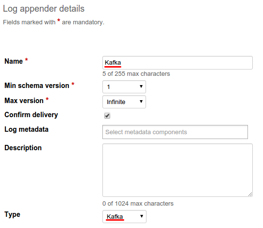
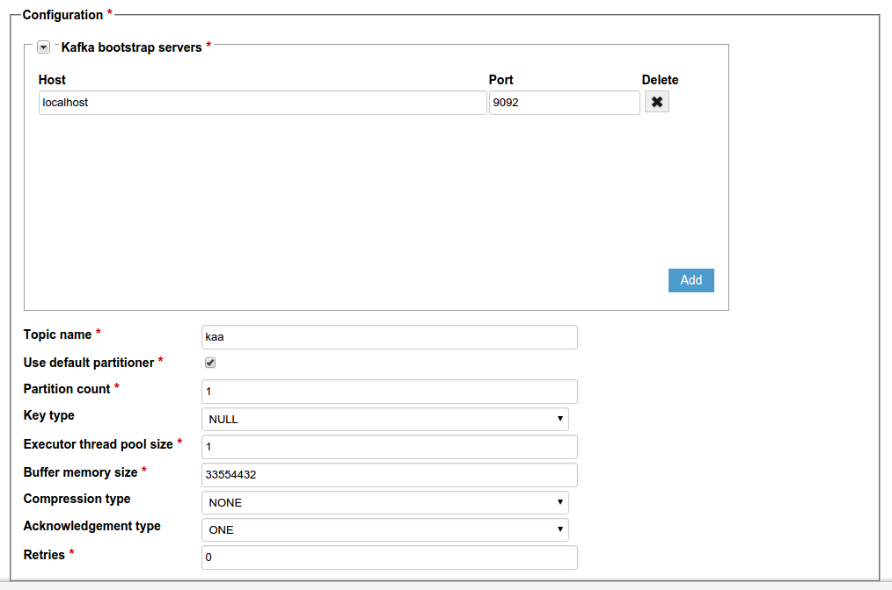



* TOC
{:toc}

The Kafka log appender is used to transfer logs from the responsible for transferring logs from the [Operations service]({{root_url}}Glossary/#operations-service) to the [Apache Kafka](https://kafka.apache.org/) service.
The logs are stored within the specified topics.

## Create Kafka log appender

To create a Kafka log appender for your application using the [Administration UI]({{root_url}}Glossary/#administration-ui):

1. Log in to the **Administration UI** page as a [tenant developer]({{root_url}}Glossary/#tenant-developer).

2. Click **Applications** and open the **Log appenders** page of your application.
Click **Add log appender**.

	

3. On the **Log appender details** page, enter the necessary information and set the **Type** field to **Kafka**.

	

4. Fill in the **Configuration** section for your log appender and click **Add**.
See [Configure log appender](#configure-log-appender).

	

Alternatively, you can use the [server REST API]({{root_url}}Programming-guide/Server-REST-APIs/#!/Logging/editLogAppender) to create or edit your Kafka log appender.

The following example illustrates how to create an instance of Kafka log appender using the server REST API.

```bash
curl -v -S -u devuser:devuser123 -X POST -H 'Content-Type: application/json' -d @kafkaLogAppender.json "http://localhost:8080/kaaAdmin/rest/api/logAppender" | python -mjson.tool
```

where file `kafkaLogAppender.json` contains the following data.

```
{
    "pluginClassName":"org.kaaproject.kaa.server.appenders.kafka.appender.KafkaLogAppender",
    "pluginTypeName":"Kafka",
    "applicationId":"5",
    "applicationToken":"82635305199158071549",
    "name":"Sample Kafka log appender",
    "description":"Sample Kafka log appender",
    "headerStructure":[
        "KEYHASH",
        "VERSION",
        "TIMESTAMP",
        "TOKEN",
        "LSVERSION"
    ],
    "maxLogSchemaVersion":2147483647,
    "minLogSchemaVersion":1,
    "tenantId":"1",
    "jsonConfiguration":"{\"kafkaServers\":[{\"host\":\"localhost\",\"port\":9092}],\"topic\":\"kaa\",\"useDefaultPartitioner\":true,\"partitionCount\":1,\"kafkaKeyType\":{\"org.kaaproject.kaa.server.appenders.kafka.config.gen.KafkaKeyType\":\"NULL\"},\"executorThreadPoolSize\":1,\"bufferMemorySize\":33554432,\"kafkaCompression\":{\"org.kaaproject.kaa.server.appenders.kafka.config.gen.KafkaCompression\":\"NONE\"},\"kafkaAcknowledgement\":{\"org.kaaproject.kaa.server.appenders.kafka.config.gen.KafkaAcknowledgement\":\"ONE\"},\"retries\":0}"
}
```

Below is an example result.

```json
{
    "applicationId": "5",
    "applicationToken": "82635305199158071549",
    "confirmDelivery": true,
    "createdTime": 1466497790454,
    "createdUsername": "devuser",
    "description": "Sample Kafka log appender",
    "headerStructure": [
        "KEYHASH",
        "VERSION",
        "TIMESTAMP",
        "TOKEN",
        "LSVERSION"
    ],
    "id": "131077",
    "jsonConfiguration": "{\"kafkaServers\":[{\"host\":\"localhost\",\"port\":9092}],\"topic\":\"kaa\",\"useDefaultPartitioner\":true,\"partitionCount\":1,\"kafkaKeyType\":{\"org.kaaproject.kaa.server.appenders.kafka.config.gen.KafkaKeyType\":\"NULL\"},\"executorThreadPoolSize\":1,\"bufferMemorySize\":33554432,\"kafkaCompression\":{\"org.kaaproject.kaa.server.appenders.kafka.config.gen.KafkaCompression\":\"NONE\"},\"kafkaAcknowledgement\":{\"org.kaaproject.kaa.server.appenders.kafka.config.gen.KafkaAcknowledgement\":\"ONE\"},\"retries\":0}",
    "maxLogSchemaVersion": 2147483647,
    "minLogSchemaVersion": 1,
    "name": "Sample Kafka log appender",
    "pluginClassName": "org.kaaproject.kaa.server.appenders.kafka.appender.KafkaLogAppender",
    "pluginTypeName": "Kafka",
    "tenantId": "1"
}
```

## Configure log appender

The Cassandra log appender configuration must match [this Avro schema]({{github_url}}server/appenders/kafka-appender/src/main/avro/kafka-appender-config.avsc).

You can configure the following log appender settings:

|Name                   |Description                                                                                                            |
|-----------------------|-----------------------------------------------------------------------------------------------------------------------|
|`bufferMemorySize`     |Message buffer size in bytes.                                                                                           |
|`executorThreadPoolSize`|Number of threads that can simultaneously perform an operation with your Kafka log appender.                                            |
|`kafkaAcknowledgement`   |Number of acknowledgments that the producer requires the leader to receive before considering a request complete.  |
|`kafkaCompression`       |Type of built-in message compression.                                                                             |
|`kafkaKeyType`           |Type of generated message key.                                                                                          |
|`kafkaServers`           |List of Kafka bootstrap servers (host name and port pairs).                                                              |
|`partitionCount`         |Count of event partitions.                                                                                             |
|`retries`                |Failover property. Number of retries for message delivery failure due to no connection.                                             |
|`topic`                  |Logs destination topic.                                                                                                 |
|`useDefaultPartitioner`  |If false, the log appender will calculate partitions independently.                                                              |

Below is an example configuration that matches the mentioned Avro schema.

```json
{
    "kafkaServers":[
        {
            "host":"localhost",
            "port":9092
        }
    ],
    "topic":"kaa",
    "useDefaultPartitioner":{
        "boolean":true
    },
    "partitionCount":{
        "int":1
    },
    "kafkaKeyType":{
        "org.kaaproject.kaa.server.appenders.kafka.config.gen.KafkaKeyType":"NULL"
    },
    "executorThreadPoolSize":{
        "int":1
    },
    "bufferMemorySize":{
        "long":33554432
    },
    "kafkaCompression":{
        "org.kaaproject.kaa.server.appenders.kafka.config.gen.KafkaCompression":"NONE"
    },
    "kafkaAcknowledgement":{
        "org.kaaproject.kaa.server.appenders.kafka.config.gen.KafkaAcknowledgement":"ONE"
    },
    "retries":{
        "int":0
    }
}
```

## Playing with Kafka log appender

The example below uses the **Data collection demo** from [Kaa Sandbox]({{root_url}}Glossary/#kaa-sandbox).

Before proceeding with the example below:

1. [Install Kafka](https://kafka.apache.org/07/quickstart.html).

2. Change Zookeeper to use some other port than 2181 (e.g. 2183).

3. Edit the following property files:

	* `config/zookeeper.properties`: set `clientPort=2183`
	* `config/server.properties`: set `zookeeper.connect=localhost:2183`
	* `config/consumer.properties`: set `zookeeper.connect=127.0.0.1:2183`

4. Launch Kafka.

Below is the log schema for the application.

```json
{
    "type":"record",
    "name":"Data",
    "namespace":"org.kaaproject.kaa.scheme.sample",
    "fields":[
        {
            "name":"temperature",
            "type":"int"
        },
        {
            "name":"timeStamp",
            "type":"long"
        }
    ],
    "displayName":"Logging scheme"
}
```

The following JSON example matches the schema above.

```json
{
    "temperature":"28",
    "timeStamp":"1474366798"
}

```

To play around with the Kafka log appender:

1. Open the Data collection demo from Kaa Sandbox, follow the application installation instructions, and run the application.

2. Create a Kafka log appender as described [above](#create-kafka-log-appender).

3. Run the following command from the Kafka installation directory.

		bin/kafka-console-consumer.sh --zookeeper localhost:2183 --topic kaa

This will trigger the Kafka consumer that enables you to see the logs transferred from Kaa.

4. Use instructions from Sandbox to run Data collection demo application.

5. Your running Data collection demo application will display the output similar to the example below.

		Data collection demo started
		Received new sample period: 1
		Sampled temperature 28 1474622330
		Sampled temperature 31 1474622331
		Sampled temperature 32 1474622332
		Sampled temperature 30 1474622333
		Sampled temperature 28 1474622334
		...

6. To verify that Kafka consumer received the logs, run the following command from the Kafka installation directory.

		bin/kafka-console-consumer.sh --zookeeper localhost:2183 --topic kaa

The console will display similar output.
		
		{"header":{"endpointKeyHash":{"string":"tqoeo8S49HgakOV/2DfiEZLjGls="},"applicationToken":{"string":"24212667430286144698"},"headerVersion":{"int":1},"timestamp":{"long":1474622333932},"logSchemaVersion":{"int":2}},"event":{"temperature":28,"timeStamp":1474622330}}
		{"header":{"endpointKeyHash":{"string":"tqoeo8S49HgakOV/2DfiEZLjGls="},"applicationToken":{"string":"24212667430286144698"},"headerVersion":{"int":1},"timestamp":{"long":1474622333932},"logSchemaVersion":{"int":2}},"event":{"temperature":28,"timeStamp":1474622330}}
		{"header":{"endpointKeyHash":{"string":"tqoeo8S49HgakOV/2DfiEZLjGls="},"applicationToken":{"string":"24212667430286144698"},"headerVersion":{"int":1},"timestamp":{"long":1474622333932},"logSchemaVersion":{"int":2}},"event":{"temperature":28,"timeStamp":1474622330}}
		{"header":{"endpointKeyHash":{"string":"tqoeo8S49HgakOV/2DfiEZLjGls="},"applicationToken":{"string":"24212667430286144698"},"headerVersion":{"int":1},"timestamp":{"long":1474622333932},"logSchemaVersion":{"int":2}},"event":{"temperature":28,"timeStamp":1474622330}}
		{"header":{"endpointKeyHash":{"string":"tqoeo8S49HgakOV/2DfiEZLjGls="},"applicationToken":{"string":"24212667430286144698"},"headerVersion":{"int":1},"timestamp":{"long":1474622333932},"logSchemaVersion":{"int":2}},"event":{"temperature":28,"timeStamp":1474622330}}

If you don't get the desired output or experience other problems, see [Troubleshooting]({{root_url}}Administration-guide/Troubleshooting).
