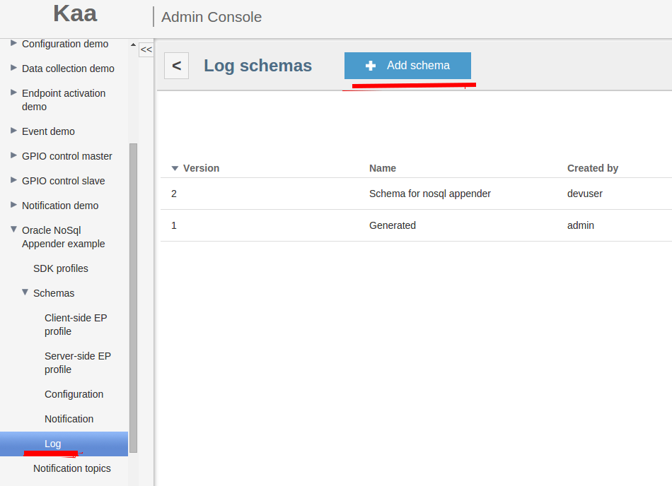
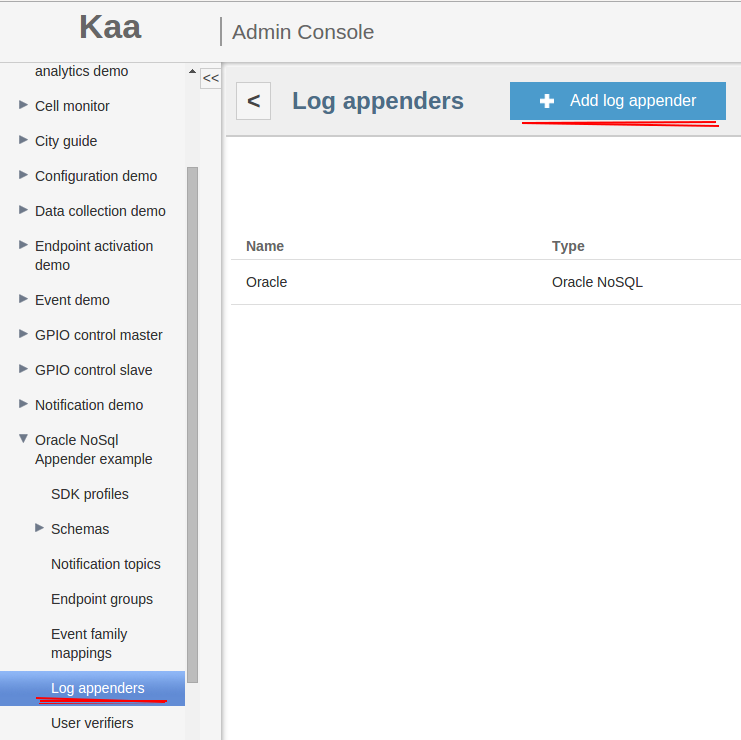



* TOC
{:toc}

The Oracle NoSQL log appender is used to transfer logs from the [Operations service]({{root_url}}Glossary/#operations-service) to the [Oracle NoSQL](https://www.oracle.com/database/nosql/index.html) key/value storage.

## Create Oracle NoSQL log appender

The easiest way to create an instance of the Oracle NoSQL log appender for the application is by using Admin UI.

To create a log appender of the Oracle NoSQL key/value storage type, do the following:

1. In the **Log appenders** window, click **Add log appender**.
2. Enter the log appender name and description, select the minimum and maximum supported schema version, select necessary log metadata fields.
3. Set the log appender type to _Oracle NoSQL_.
4. Fill in the Oracle NoSQL log appender configuration form.
5. Click **Add** button. Log appender is ready and operational at this point.


## Creating Oracle NoSQL log appender with Admin REST API

It is also possible to create an instance of the Oracle NoSQL log appender for the application by using the [REST API]({{root_url}}Programming-guide/Server-REST-APIs/#!/Logging/editLogAppender). 
The following example illustrates how to create the Oracle NoSQL log appender via the Admin REST API.

### Configure log appender

Logs are stored in the storage using the following key path:

```bash
${applicationToken}/${logSchemaVersion}/${endpointKeyHash}/${uploadTimestamp}/${counter}
```

The path variables used are:

|Path Variable      |Description                                                    |
|-------------------|---------------------------------------------------------------|
|applicationToken   |The token of the application                                   |
|logSchemaVersion   |The version of the log schema                                  |
|endpointKeyHash    |The ID of the endpoint the log data belongs to                 |
|uploadTimestamp    |The timestamp of log upload to the storage (in milliseconds)   |
|count              |The log record ID                                              |

Values are stored as serialized generic records using record wrapper Avro schema.

The Oracle NoSQL log appender configuration must match to
[this]({{github_url}}server/appenders/oracle-nosql-appender/src/main/avro/oracle-nosql-appender-config.avsc) Avro schema.

An example configuration that matches to previously introduced Avro schema is as below:

```json
{
    "storeName":"kvstore",
    "kvStoreNodes":[
        {
            "host":"localhost",
            "port":5000
        }
    ],
    "username":null,
    "walletDir":null,
    "pwdFile":null,
    "securityFile":null,
    "transport":null,
    "ssl":null,
    "sslCipherSuites":null,
    "sslProtocols":null,
    "sslHostnameVerifier":null,
    "sslTrustStore":null,
    "sslTrustStoreType":null
}
```

### Administration

The following Admin REST API call example illustrates how to create a new instance of the Oracle NoSQL log appender:

```bash
curl -v -S -u devuser:devuser123 -X POST -H 'Content-Type: application/json' -d @oracleNoSQLlogAppender.json "http://localhost:8080/kaaAdmin/rest/api/logAppender" | python -mjson.tool
```

where file `oracleNoSQLlogAppender.json` contains following data:

```
{
    "pluginClassName":"org.kaaproject.kaa.server.appenders.oraclenosql.appender.OracleNoSqlLogAppender",
    "pluginTypeName":"Oracle NoSQL",
    "applicationId":"5",
    "applicationToken":"82635305199158071549",
    "name":"Sample Oracle NoSQL log appender",
    "description":"Sample Oracle NoSQL log appender",
    "headerStructure":[
        "KEYHASH",
        "VERSION",
        "TIMESTAMP",
        "TOKEN",
        "LSVERSION"
    ],
    "maxLogSchemaVersion":2147483647,
    "minLogSchemaVersion":1,
    "tenantId":"1",
    "jsonConfiguration":"{\"storeName\":\"kvstore\",\"kvStoreNodes\":[{\"host\":\"localhost\",\"port\":5000}],\"username\":null,\"walletDir\":null,\"pwdFile\":null,\"securityFile\":null,\"transport\":null,\"ssl\":null,\"sslCipherSuites\":null,\"sslProtocols\":null,\"sslHostnameVerifier\":null,\"sslTrustStore\":null,\"sslTrustStoreType\":null}"
}
```

Example result:

```json
{
    "applicationId":"5",
    "applicationToken":"82635305199158071549",
    "confirmDelivery":true,
    "createdTime":1466506070066,
    "createdUsername":"devuser",
    "description":"Sample Oracle NoSQL log appender",
    "headerStructure":[
        "KEYHASH",
        "VERSION",
        "TIMESTAMP",
        "TOKEN",
        "LSVERSION"
    ],
    "id":"163842",
    "jsonConfiguration":"{\"storeName\":\"kvstore\",\"kvStoreNodes\":[{\"host\":\"localhost\",\"port\":5000}],\"username\":null,\"walletDir\":null,\"pwdFile\":null,\"securityFile\":null,\"transport\":null,\"ssl\":null,\"sslCipherSuites\":null,\"sslProtocols\":null,\"sslHostnameVerifier\":null,\"sslTrustStore\":null,\"sslTrustStoreType\":null}",
    "maxLogSchemaVersion":2147483647,
    "minLogSchemaVersion":1,
    "name":"Sample Oracle NoSQL log appender",
    "pluginClassName":"org.kaaproject.kaa.server.appenders.oraclenosql.appender.OracleNoSqlLogAppender",
    "pluginTypeName":"Oracle NoSQL",
    "tenantId":"1"
}
```

## Playing with Oracle NoSQL log appender

1. Download archive with [Oracle nosql database](http://www.oracle.com/technetwork/database/database-technologies/nosqldb/downloads/index.html)
and install it to your Kaa server.
2. Use [following](https://blogs.oracle.com/charlesLamb/entry/oracle_nosql_database_in_5) tutorial for more information about this database.
3. Create an application using Admin UI or [server REST API]({{root_url}}Programming-guide/Server-REST-APIs).
4. Add custom log schema that will be using for saving logs in database.

5. Add Oracle Nosql log appender and define configuration for it.

6. Generate SDK for your platform and write code to send logs to database.
7. Your client code might look like this:

    ```bash
    ...
    KaaClient client = ...
    ...
    Data data = new Data("your log data");
    //send logs to oracle database
    client.addLogRecord(data);
    ...
    ```

8.  To verify that our logs have been persisted in Oracle NoSQL storage do following:

    * Open admin console and run following command:

    ```bash
    java -jar path_to_oracle_db/lib/kvstore.jar runadmin -host $your_host$ -port $your_port$
    ```

    Where $your_host$ and $your_port$ is your host and port addresses respectively.


    * Connect to your storage:

    ```bash
    connect store -name kvstore  -host $oracle_db_host$  -port $oracle_db_port$;
    ```

    Where $oracle_db_host$ and $oracle_db_port$ is KVStore node host and port addresses respectively.

    * Run:

    ```bash
    get kv -start /${applicationToken} -all
    ```

    * Than in your database you will see something like the below:

    ```json
    /97657068517919541825/2/519xnHqR4xVpq2MSoLSUKgmSTa4=/1456227512249/-/0
    {
        "recordHeader":{
            "org.kaaproject.kaa.server.common.log.shared.avro.gen.RecordHeader":{
                "endpointKeyHash":null,
                "applicationToken":null,
                "headerVersion":null,
                "timestamp":null,
                "logSchemaVersion":null
            }
        },
        "recordData":{
            "org.kaaproject.kaa.example.nosql.Data":{
                "logInfo":{
                    "string":"your log data"
                }
            }
        }
    }
    ```

If you don't get the desired output or experience other problems, see [Troubleshooting]({{root_url}}Administration-guide/Troubleshooting).
