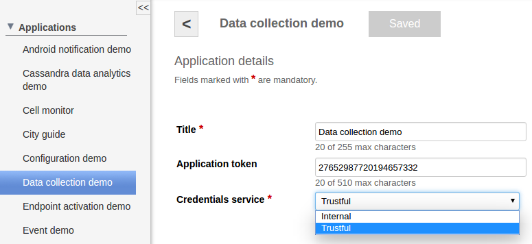

* TOC
{:toc}



To function within the [Kaa platform]({{root_url}}Glossary/#kaa-platform), every [endpoint]({{root_url}}Glossary/#endpoint-ep) must be uniquely identified and provisioned with credentials.
This section discusses the process of endpoint authentication and the functionality of the Kaa Credentials service.

## Endpoint authentication

In the default implementation, Kaa platform uses hybrid encryption system that is based on RSA with 2048-bit key pair and AES with 256(512)-bit key.
During the start of a new session, every endpoint sends an encrypted and digitally signed session key.
Session key is a randomly generated AES key that is also encrypted with public key of the Kaa node that handles this session or request.
The digital signature of a session key is based on the private key of the endpoint.
To authenticate an endpoint and validate its request, Kaa node validates the digital signature of the session key.

Although other authentication strategies are possible, they are out of scope of this section.

## Endpoint registration

To function within a [Kaa cluster]({{root_url}}Glossary/#kaa-cluster), every endpoint must be registered using the security credentials and the endpoint profile.
During the registration process, the endpoint first communicates with one or multiple [Bootstrap services]({{root_url}}Glossary/#bootstrap-service) to obtain a list of available [Operations services]({{root_url}}Glossary/#operations-service).
Then it communicates with the Operations service to submit the endpoint data (credentials ID and the endpoint profile) and complete the registration.

The endpoint registration process is illustrated in the picture below.


### List of Operations services

For security and load-balancing reasons, Kaa endpoint SDKs do not include any information about Operations services.
Instead, a [Control service]({{root_url}}Glossary/#control-service) embeds a list of available Bootstrap services into the SDK during the SDK generation process.
This list is saved as a properties file in case with Java SDK, and as a header file in case with other [SDK types]({{root_url}}Glossary/#sdk-type).
The endpoint selects a random Bootstrap service from the list and sends a resolution request to the selected Bootstrap service.
The resolution request contains the [application token]({{root_url}}Glossary/#application-token) that can be used by the Bootstrap service in specific load-balancing strategies.
The resolution response from the Bootstrap service contains a prioritized list of Operations services with their connectivity details and is signed with the Bootstrap service private key.
The endpoint verifies the signature of the response using the Bootstrap public key available from the build time parameters and saves the received information.

### Endpoint authorization

Endpoint authorization is done by validating the endpoint credentials using the corresponding Credentials service.
Credentials service can be configured for each Kaa application individually.
To do this, you can use the [Administration UI]({{root_url}}Glossary/#administration-ui) or the corresponding [server REST API]({{root_url}}Programming-guide/Server-REST-APIs/#!/Application/editApplication).



The endpoint credentials ID is generated based on the public RSA key hash of the endpoint.
When a new session starts, the Operations service queries the Credentials service for credentials status.
If the credentials are not valid or in use by other endpoint, Kaa node will reject the session.

### Endpoint registration data

Prior to the actual endpoint registration, Kaa platform user can use the endpoint credentials data to provision server-side profiles for new endpoints.
This server-side profile will be used during endpoint registration.
This can be useful when, for example, an endpoint manufacturer wants to provision sensitive information to the server-side endpoint profile based on the security keys that are only available during manufacturing process.
For more information, see [Administration REST API]({{root_url}}Programming-guide/Server-REST-APIs/#!/Device_management/provisionCredentials).

## Credentials service

Kaa provides two Credentials service implementations out of the box:

- Trustful credentials service: default implementation that allows any endpoint to register and connect to Kaa cluster.
This service will accept credentials from any endpoint.

- Internal credentials service: allows connection to Kaa cluster only to specified list of endpoints whose credentials were previously provisioned to Kaa server.
For more information, see [Administration REST API]({{root_url}}Programming-guide/Server-REST-APIs/#!/Device_management/provisionCredentials).

### Custom implementation of Credentials service

Here is an example of a custom implementation of Credentials service:

<ol>
<li markdown="1">
Create a class that implements all methods of [CredentialsService interface]({{github_url}}server/node/src/main/java/org/kaaproject/kaa/server/node/service/credentials/CredentialsService.java).

```java

package org.myproject;

@Service
public class CustomCredentialsService implements CredentialsService {

	/**
	 * Provide credentials information to the external system.
	 */
	@Override
	public CredentialsDto provideCredentials(String applicationId, CredentialsDto credentials) throws CredentialsServiceException {
		// implementation
	}

	/**
	 * Returns the credentials by ID.
	 */
	@Override
	public Optional<CredentialsDto> lookupCredentials(String applicationId, String credentialsId) throws CredentialsServiceException {
		// implementation
	}

	/**
	 * Sets the status of the given credentials to CredentialsStatus.IN_USE
	 */
	@Override
	public void markCredentialsInUse(String applicationId, String credentialsId) throws CredentialsServiceException {
		// implementation
	}

	/**
	 * Revokes the given credentials by setting their status to CredentialsStatus.REVOKED
	 */
	@Override
	public void markCredentialsRevoked(String applicationId, String credentialsId) throws CredentialsServiceException {
		// implementation
	}
}

```
</li>
<li markdown="1">
Register `CredentialsServiceLocator` in the `/usr/lib/kaa-node/conf/kaaNodeContext.xml` file for your new credential service.

```xml

<bean id="customCredentialsServiceLocator" class="org.kaaproject.kaa.server.node.service.credentials.InternalCredentialsServiceLocator">
    <constructor-arg ref="org.myproject.customCredentialsService"/>
</bean>
    
<util:map id="credentialsServiceLocatorMap">
    <entry key="Trustful" value-ref="trustfulCredentialsServiceLocator"/>
    <entry key="Internal" value-ref="internalCredentialsServiceLocator"/>
    <entry key="NEW" value-ref="customCredentialsServiceLocator"/>                          
</util:map>

```

The key value you added will be displayed in the **Administration UI**.


</li>
<li markdown="1">
Edit the `/usr/lib/kaa-node/conf/common-dao-context.xml` file.

```xml

<bean id="customCredentialsService" class="org.myproject.CustomCredentialsService"/>

```

</li>
</ol>

### Provisioning of custom Credentials service

To provision your Credentials service:

1. Build your application:

   ```bash
      $ mvn clean install
   ```

2. Move the `.jar` file of your application from the `target` folder to the `/usr/lib/kaa-node/lib` folder.

3. If you use other package than `org.kaaproject.kaa.*`, make it scan the `kaa-node.properties` file in the `/usr/lib/kaa-node/conf` folder.
For example: `additional_plugins_scan_package=org.myproject`

4. Restart the `kaa-node` service:

   ```bash
      $ sudo service kaa-node restart
   ```