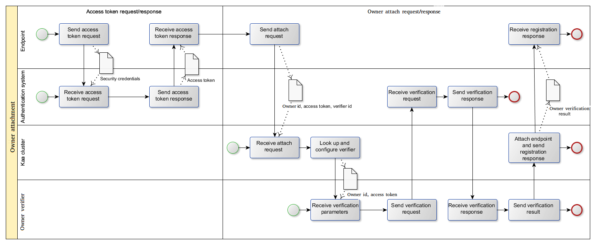
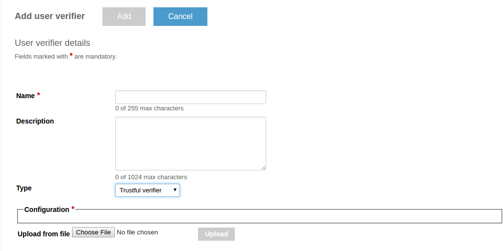
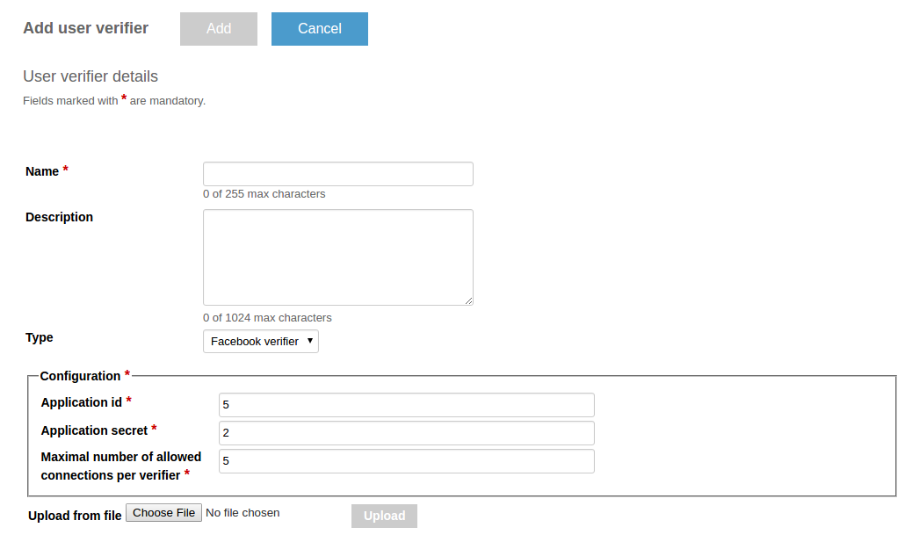
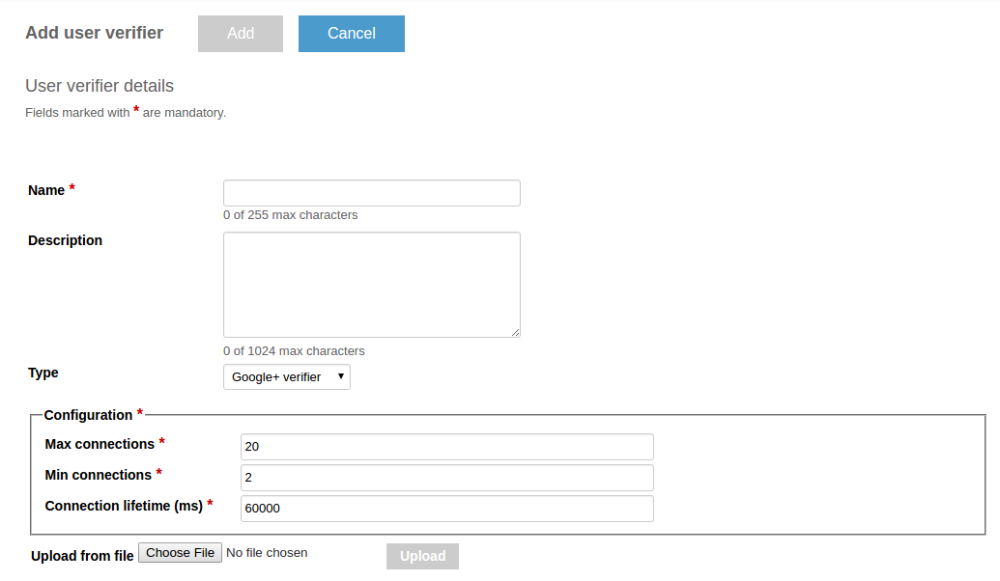
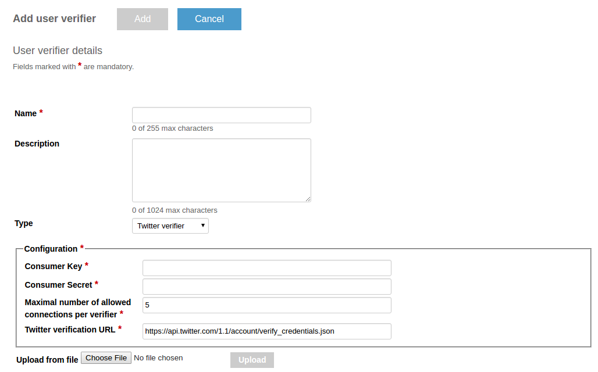



* TOC
{:toc}

In Kaa, users can associate [endpoints]({{root_url}}Glossary/#endpoint-ep) to owners.
Depending on the [application]({{root_url}}Glossary/#kaa-application), owners can be persons, groups of people, or organizations.

For example, if you have a smart TV in your house, all your family members are the users of the smart TV endpoint.
In this case, your family is the group of people (owner) that own the smart TV, and the smart TV is the endpoint attached to this group.
To attach/detach endpoints to/from owners, you can use either [owner access token](#using-the-owner-access-token), or [endpoint access token](#using-the-endpoint-access-token).

## Using the owner access token

As an owner, you can authenticate using an external authentication system and obtain your _access token_.
You need to perform this authentication from the endpoint that is duly registered in the [Kaa instance]({{root_url}}Glossary/#kaa-instance-kaa-deployment).
Your [endpoint SDK]({{root_url}}Glossary/#endpoint-sdk) sends this token to the [Kaa cluster]({{root_url}}Glossary/#kaa-cluster) over a secure channel.
The Kaa cluster verifies the access token and attaches the endpoint to the owner.



### Owner verifiers

The owner verification is handled by specific server components called _owner verifiers_.
There are several default implementations of the owner verifier available out of the box for each Kaa installation.
This section contains general information about the architecture, configuration, and administration of the default owner verifiers.
You can also plug in [custom verifier implementations](#custom-owner-verifier).
One [Kaa application]({{root_url}}Glossary/#kaa-application) can support multiple owner verifiers.

To add a new verifier, use the [server REST API]({{root_url}}Programming-guide/Server-REST-APIs/#!/Verifiers/editUserVerifier) or open the **User verifier** page of your application.


### Trustful owner verifier

This owner verifier implementation always accepts any owner ID and access token and is created for testing and debugging purposes.
Since the verifier schema is empty, there is no specific configuration for this verifier.

To add a trustful verifier, use the [server REST API]({{root_url}}Programming-guide/Server-REST-APIs/#!/Verifiers/editUserVerifier) or choose the **trustful verifier** type from the drop-down list on the **Add user verifier details** page.



>**CAUTION:** Do not use this owner verifier in production because it may cause security issues.
{:.caution}

### Facebook owner verifier

This owner verifier implementation is created to verify Facebook accounts.
It is especially useful for applications that are already integrated with Facebook.


#### Configuration ###

First, create a [facebook application](https://developers.facebook.com/products/login/), then specify its application ID and [secret](https://developers.facebook.com/docs/graph-api/securing-requests) in the configuration.

The following Avro schema defines the configuration.

```json
{
        "namespace": "org.kaaproject.kaa.server.verifiers.facebook.config.gen",
        "type": "record",
        "name": "FacebookAvroConfig",
        "fields": [
        {
            "name": "app_id",
            "displayName": "Application id",
            "type": "string"
        },
        {
            "name": "app_secret",
            "displayName": "Application secret",
            "type": "string"
        },
        {
           "name": "max_parallel_connections",
           "displayName": "Maximal number of allowed connections per verifier",
           "type": "int", "by_default": "5"
        }
    ]
}
```

The following configuration example matches the previous schema.

```json
{
    "app_id":"XXXXXXXXXXXXXXXX",
    "app_secret":"XXXXXXXXXXXXXXXXXXXXXXXXXXXXXXXX",
    "max_parallel_connections":"10"
}
```


#### Administration

To create a Facebook owner verifier, use the [Administration UI]({{root_url}}Glossary/#administration-ui) or [server REST API]({{root_url}}Programming-guide/Server-REST-APIs/#!/Verifiers/editUserVerifier).
If you want to use the Administration UI, choose the **Facebook verifier** type from the drop-down list on the **Add user verifier details** page.



### Google+ owner verifier

This owner verifier implementation is created to verify Google+ accounts.
It is especially useful for applications that are already integrated with Google+.

#### Configuration

The following Avro schema defines the configuration.

```json
{
 "namespace": "org.kaaproject.kaa.server.verifiers.gplus.config.gen",
 "type": "record",
 "name": "GplusAvroConfig",
 "fields": [
    {
    "name":"max_parallel_connections",
    "displayName": "Maximum parallel connections opened",
    "type":"int", "by_default" : "20"
    },
    {
    "name":"min_parallel_connections",
    "displayName": "Minimum parallel connections opened",
    "type":"int", "by_default" : "2"
    },
    {
    "name":"keep_alive_time_milliseconds",
    "displayName": "Milliseconds to keep connection alive",
    "type":"long", "by_default" : "60000"
    }
 ]
}
```

#### Administration

To create a Google+ owner verifier, use the [server REST API]({{root_url}}Programming-guide/Server-REST-APIs/#!/Verifiers/editUserVerifier) or choose the **Google+ verifier** type from the drop-down list on the **Add user verifier details** page.



### Twitter owner verifier

This owner verifier implementation is created to verify Twitter accounts.
It is especially useful for applications that are already integrated with Twitter.

#### Configuration

The following Avro schema defines the configuration.

```json 
{
    "namespace": "org.kaaproject.kaa.server.verifiers.twitter.config.gen",
    "type": "record",
    "name": "TwitterAvroConfig",
    "fields": [
        {
            "name": "consumer_key",
            "displayName": "Consumer Key",
            "type": "string"
        },
        {
            "name": "consumer_secret",
            "displayName": "Consumer Secret",
            "type": "string"
        },
        {
            "name": "max_parallel_connections",
            "displayName": "Maximum number of allowed connections per verifier",
            "type": "int", "by_default": "5"
        }
    ]
}
```

#### Administration

To create a Twitter owner verifier, use the [server REST API]({{root_url}}Programming-guide/Server-REST-APIs/#!/Verifiers/editUserVerifier) or choose the **Twitter verifier** type from the drop-down list on the **Add user verifier details** page.



### Custom owner verifier

You can implement a custom plug-in verifier.
To do this, follow the instructions in [Creating custom owner verifier]({{root_url}}Customization-guide/Kaa-Server/Development-environment-setup/#creating-custom-user-verifier).


## Using the endpoint access token

You can use an owner's endpoint to attach new endpoints to that owner.
Assume you have a new endpoint B that you want to attach to the owner using the previously attached endpoint A.

The process flows as follows:

1. The endpoint B periodically generates and sends its access token to the Kaa cluster.

2. The endpoint B displays its access token as a QR code on the screen (TV) or on the webpage (e.g., a router or other device with an embedded server).

3. The endpoint A retrieves this token by scanning QR code or in any other suitable way and sends it in the endpoint attach request to the Kaa cluster.

4. The Kaa cluster verifies the access code and attaches the endpoint B to the owner of the endpoint A.


### Attach endpoint to owner

[Kaa client]({{root_url}}Glossary/#kaa-client) attaches the endpoint to the owner as shown in the following examples for different [SDK types]({{root_url}}Glossary/#sdk-type).

<ul class="nav nav-tabs">
  <li class="active"><a data-toggle="tab" href="#Java">Java</a></li>
  <li><a data-toggle="tab" href="#C_plus_plus">C++</a></li>
  <li><a data-toggle="tab" href="#C">C</a></li>
  <li><a data-toggle="tab" href="#Objective-C">Objective-C</a></li>
</ul>

<div class="tab-content">
<div id="Java" class="tab-pane fade in active" markdown="1" >

```java
import org.kaaproject.kaa.client.KaaClient;
import org.kaaproject.kaa.client.KaaDesktop;
import org.kaaproject.kaa.client.event.registration.UserAuthResultListener;
 
/**
* Creates owner attach request using default verifier. Default verifier is selected during SDK generation.
* If there was no default verifier selected this method will throw runtime exception.
*/

kaaClient.attachUser("userExternalId", "userAccessToken", new UserAttachCallback()
{
    @Override
    public void onAttachResult(UserAttachResponse response) {
        System.out.println("Attach response" + response.getResult());
    }
});


/**
* Creates owner attach request using specified verifier.
*/
kaaClient.attachUser("userVerifierToken", "userExternalId", "userAccessToken", new UserAttachCallback()
{
    @Override
    public void onAttachResult(UserAttachResponse response) {
        System.out.println("Attach response" + response.getResult());
    }
});
```

</div>
<div id="C_plus_plus" class="tab-pane fade" markdown="1" >

```c++
#include <memory>
#include <iostream>
 
#include <kaa/Kaa.hpp>
#include <kaa/event/registration/SimpleUserAttachCallback.hpp>
 
using namespace kaa;
 
class SimpleUserAttachCallback : public IUserAttachCallback {
public:
    virtual void onAttachSuccess()
    {
        std::cout << "Endpoint is attached to a user" << std::endl;
    }
 
    virtual void onAttachFailed(UserAttachErrorCode errorCode, const std::string& reason)
    {
        std::cout << "Failed to attach endpoint to a user: error code " << errorCode << ", reason '" << reason << "'" << std::endl;
    }
};
 
...
  
// Create an endpoint instance
auto kaaClient = Kaa::newClient();
 
// Start an endpoint
kaaClient->start();
 
// Try to attach an endpoint to a user
kaaClient->attachUser("userExternalId", "userAccessToken", std::make_shared<SimpleUserAttachCallback>());
```

</div>
<div id="C" class="tab-pane fade" markdown="1" >

```c
#include <kaa/kaa_user.h>
#include <kaa/platform/ext_user_callback.h>
 
kaa_client_t *kaa_client = /* ... */;
 
kaa_error_t on_attached(void *context, const char *user_external_id, const char *endpoint_access_token)
{
    return KAA_ERR_NONE;
}
kaa_error_t on_detached(void *context, const char *endpoint_access_token)
{
    return KAA_ERR_NONE;
}
kaa_error_t on_attach_success(void *context)
{
    return KAA_ERR_NONE;
}
kaa_error_t on_attach_failed(void *context, user_verifier_error_code_t error_code, const char *reason)
{
    return KAA_ERR_NONE;
}
kaa_attachment_status_listeners_t attachement_listeners = 
{
        NULL,
        &on_attached,
        &on_detached,
        &on_attach_success,
        &on_attach_failed
};
/* Assume Kaa SDK is already initialized */
kaa_error_t error_code = kaa_user_manager_set_attachment_listeners(kaa_client_get_context(kaa_client)->user_manager
                                                                 , &attachement_listeners);
/* Check error code */
error_code = kaa_user_manager_default_attach_to_user(kaa_client_get_context(kaa_client)->user_manager
                                                   , "userExternalId"
                                                   , "userAccessToken");
/* Check error code */
```

</div>
<div id="Objective-C" class="tab-pane fade" markdown="1" >

```objc
@import Kaa;
 
@interface ViewController () <UserAttachDelegate>
 
...
 
- (void)prepareUserForMessaging {
    [self.kaaClient attachUserWithId:@"userExternalId" accessToken:@"userAccessToken" delegate:self];
}
 
- (void)onAttachResult:(UserAttachResponse *)response {
    NSLog(@"Attach response: %i", response.result);
}
```

</div>
</div>


### Assisted attachment

Some endpoints may not be able to attach themselves independently.
For example, when an endpoint does not have an owner access token.
In this case, another endpoint that is already attached can assist in the attachment process of the new endpoint.

Below are examples of assisted attachment.

<ul class="nav nav-tabs">
  <li class="active"><a data-toggle="tab" href="#Java-1">Java</a></li>
  <li><a data-toggle="tab" href="#C_plus_plus-1">C++</a></li>
  <li><a data-toggle="tab" href="#C-1">C</a></li>
  <li><a data-toggle="tab" href="#Objective-C-1">Objective-C</a></li>
</ul>

<div class="tab-content">
<div id="Java-1" class="tab-pane fade in active" markdown="1" >

```java
import org.kaaproject.kaa.client.KaaClient;
import org.kaaproject.kaa.client.KaaDesktop;
import org.kaaproject.kaa.client.event.registration.OnAttachEndpointOperationCallback;
 
/**
* Updates with new endpoint attach request
*
* @param   endpointAccessToken Access token of the endpoint being attached
* @param   resultListener      Listener to notify about result of the endpoint attaching
*
*/

kaaClient.attachEndpoint("endpointAccessToken", new OnAttachEndpointOperationCallback()
{
    @Override
    public void onAttach(SyncResponseResultType result, EndpointKeyHash resultContext) {
        //
    }
});

```

</div>
<div id="C_plus_plus-1" class="tab-pane fade" markdown="1" >

```c++
#include <memory>
#include <iostream>
 
#include <kaa/Kaa.hpp>
#include <kaa/event/registration/SimpleUserAttachCallback.hpp>
 
using namespace kaa;
 
class SimpleEndpointAttachCallback : public IAttachEndpointCallbackPtr {
public:
    virtual void onAttachSuccess()
    {
        std::cout << "Endpoint is attached to a user" << std::endl;
    }
 
    virtual void onAttachFailed(UserAttachErrorCode errorCode, const std::string& reason)
    {
        std::cout << "Failed to attach endpoint to a user: error code " << errorCode << ", reason '" << reason << "'" << std::endl;
    }
};
 
...
  
// Create an endpoint instance
auto kaaClient = Kaa::newClient();
 
// Start an endpoint
kaaClient->start();
 
// Try to attach an endpoint to a user
kaaClient->attachEndpoint("endpointAccessToken", std::make_shared<SimpleEndpointAttachCallback>());
```

</div>
<div id="C-1" class="tab-pane fade" markdown="1" >


```c
#include <stdint.h>
#include <kaa/kaa_error.h>
#include <kaa/platform/kaa_client.h>
#include <kaa/kaa_user.h>
#include <kaa/platform/ext_user_callback.h>
 
kaa_client_t *kaa_client = /* ... */;
 
kaa_attachment_status_listeners_t assisted_attachment_listeners =  /* ... */;
 
/* Assume Kaa SDK is already initialized */
 
kaa_error_t error_code = kaa_user_manager_default_attach_to_user(kaa_client_get_context(kaa_client)->user_manager
                                                                , "userExternalId"
                                                                , "userAccessToken");
 
/* Check error code */
 
error_code = kaa_user_manager_attach_endpoint(kaa_client_get_context(kaa_client)->user_manager, "externalAccessToken", &assisted_attachment_listeners);
 
/* Check error code */
```

</div>
<div id="Objective-C-1" class="tab-pane fade" markdown="1" >

```objc
@import Kaa;
 
@interface ViewController () <OnAttachEndpointOperationDelegate>
 
...
 
- (void)prepareEndpointForMessaging {
    [self.kaaClient attachEndpointWithAccessToken:@"userExternalId" delegate:self];
}
 
- (void)onAttachResult:(SyncResponseResultType)result withEndpointKeyHash:(EndpointKeyHash *)endpointKeyHash{
    NSLog(@"Attach response: %i", result);
}
```

</div>
</div>

### Detach endpoint from owner

An attached endpoint can assist in detachment process of another attached endpoint.

Below are examples of assisted detachment.

<ul class="nav nav-tabs">
  <li class="active"><a data-toggle="tab" href="#Java-2">Java</a></li>
  <li><a data-toggle="tab" href="#C_plus_plus-2">C++</a></li>
  <li><a data-toggle="tab" href="#C-2">C</a></li>
  <li><a data-toggle="tab" href="#Objective-C-2">Objective-C</a></li>
</ul>

<div class="tab-content">
<div id="Java-2" class="tab-pane fade in active" markdown="1" >

```java
import org.kaaproject.kaa.client.KaaClient;
import org.kaaproject.kaa.client.KaaDesktop;
import org.kaaproject.kaa.client.event.registration.OnDetachEndpointOperationCallback;

/**
* Updates with new endpoint detach request
*
* @param   endpointKeyHash Key hash of the endpoint being detached
* @param   resultListener Listener to notify about result of the enpoint attaching
*
*/

kaaClient.detachEndpoint("endpointKeyHash", new OnDetachEndpointOperationCallback()
{
    @Override
    public void onDetach(SyncResponseResultType result) {
        //
    }
});
```

</div>
<div id="C_plus_plus-2" class="tab-pane fade" markdown="1" >

```c++
#include <memory>
#include <iostream>
 
#include <kaa/Kaa.hpp>
#include <kaa/event/registration/SimpleUserAttachCallback.hpp>
 
using namespace kaa;
 
class SimpleEndpointDetachCallback : public IDetachEndpointCallbackPtr {
public:
    virtual void onDetachSuccess()
    {
        std::cout << "Endpoint is attached to a user" << std::endl;
    }
 
    virtual void onDetachFailed(UserAttachErrorCode errorCode, const std::string& reason)
    {
        std::cout << "Failed to detach endpoint from user: error code " << errorCode << ", reason '" << reason << "'" << std::endl;
    }
};
 
...
  
// Create an endpoint instance
auto kaaClient = Kaa::newClient();
 
// Start an endpoint
kaaClient->start();
 
// Try to attach an endpoint to a user
kaaClient->detachEndpoint("endpointKeyHash", std::make_shared<SimpleEndpointDetachCallback>());
```

</div>
<div id="C-2" class="tab-pane fade" markdown="1" >

```c
#include <stdint.h>
#include <kaa/kaa_error.h>
#include <kaa/platform/kaa_client.h>
#include <kaa/kaa_user.h>
#include <kaa/platform/ext_user_callback.h>
 
kaa_client_t *kaa_client = /* ... */;
 
kaa_attachment_status_listeners_t assisted_detachment_listeners =  /* ... */;
 
/* Assume Kaa SDK is already initialized */
 
kaa_error_t error_code = kaa_user_manager_detach_endpoint(kaa_client_get_context(kaa_client)->user_manager
                                                                , "endpointHashKey"
                                                                , &assisted_detachment_listeners);
 
/* Check error code */
 
error_code = kaa_user_manager_detach_endpoint(kaa_client_get_context(kaa_client)->user_manager, "endpointHashKey", &assisted_detachment_listeners);
 
/* Check error code */
```

</div>
<div id="Objective-C-2" class="tab-pane fade" markdown="1" >

```objc
@import Kaa;
 
@interface ViewController () <DetachEndpointFromUserDelegate>
 
...
 
- (void)prepareEndpointForMessaging {
    [self.kaaClient detachEndpointWithKeyHash:@"endpointAccessToken" delegate:self];
}
 
- (void)onDetachResult:(SyncResponseResultType)result{
    NSLog(@"Detach response : %i", result);
}
```

</div>
</div>