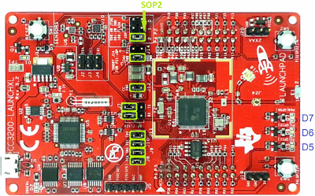



* TOC
{:toc}

This guide explains how to build a [Kaa C SDK]({{root_url}}Glossary/#kaa-sdk-type) for [Texas Instruments CC3200 LaunchPad](http://www.ti.com/tool/cc3200-Launchxl) (hereinafter, CC3200) and install [Kaa applications]({{root_url}}Glossary/#kaa) on it.

## Prerequisites

Prior to building Kaa C SDK for the CC3200 platform, install the prerequisites for your operating system.

<ul class="nav nav-tabs">
<li class="active"><a data-toggle="tab" href="#linux1">Linux</a></li>
<li><a data-toggle="tab" href="#windows1">Windows</a></li>
</ul>

<div class="tab-content"><div id="linux1" class="tab-pane fade in active" markdown="1" >

>**NOTE:** This guide is verified against:
>
> * **Host OS:** Ubuntu 14.04 LTS Desktop 64-bit
> * **Device:** TI CC3200 LaunchPad
> * **SDK version:** [CC3200 SDK v1.2.0 release](http://www.ti.com/tool/cc3200sdk)
{:.note}

1. Install the GNU ARM toolchain [gcc-arm-none-eabi](https://launchpad.net/gcc-arm-embedded).

   ```bash
   wget https://launchpad.net/gcc-arm-embedded/4.9/4.9-2015-q2-update/+download/gcc-arm-none-eabi-4_9-2015q2-20150609-linux.tar.bz2
   tar -xjf gcc-arm-none-eabi-4_9-2015q2-20150609-linux.tar.bz2
   sudo mkdir /opt/kaa
   sudo chown <username>:<usergroup> /opt/kaa
   mv gcc-arm-none-eabi-4_9-2015q2 /opt/kaa/gcc-arm-none-eabi
   ```
   
2. Install and configure [OpenOCD](http://www.openocd.net/) required for running and debugging applications.

   ```bash
   sudo apt-get install openocd
```

3. Add a rule file.

   ```bash
   cd /etc/udev/rules.d/
   sudo nano 98-usbftdi.rules
   ```
   
    Write the following code into the added rule file and then save the file.

   ```bash
   SUBSYSTEM=="usb", ATTRS{idVendor}=="0451", ATTRS{idProduct}=="c32a", MODE="0660", GROUP="dialout",
   RUN+="/sbin/modprobe ftdi-sio" RUN+="/bin/sh -c '/bin/echo 0451 c32a > /sys/bus/usb-serial/drivers/ftdi_sio/new_id'"
   ```

4. Reload the rules.

   ```bash
   sudo udevadm control --reload-rules
   ```

5. To use OpenOCD as a regular user, add yourself to the dialout group.

   ```bash
   sudo usermod -a -G dialout <username>
   ```
   
   Log out and log in to finish the process.

   >**NOTE:** The board must be enumerated as `/dev/ttyUSB{0,1}`.
   >Use ttyUSB1 for UART.
   {:.note}

6. Install [Wine](https://www.winehq.org/).

   ```bash
   sudo apt-get install wine
   ```

7. [Download](http://www.ti.com/tool/cc3200sdk) and unpack CC3200 SDK.
Change the configuration file for debug interface.

    In the `/opt/kaa/cc3200-sdk/tools/gcc_scripts/cc3200.cfg` file, replace the following lines:

   ```bash
   interface ft2232
   ft2232_layout luminary_icdi
   ft2232_device_desc "USB <-> JTAG/SWD"
   ft2232_vid_pid 0x0451 0xc32a
   ```

    with the ones below:

   ```bash
   interface ftdi
   ftdi_device_desc "USB <-> JTAG/SWD"
   ftdi_vid_pid 0x0451 0xc32a
   ftdi_layout_init 0x00a8 0x00eb
   ftdi_layout_signal nSRST -noe 0x0020
   ```

8. Edit GDB configuration.

   ```bash
   sed -i 's#-f cc3200.cfg#-f /opt/kaa/cc3200-sdk/tools/gcc_scripts/cc3200.cfg#g' /opt/kaa/cc3200-sdk/tools/gcc_scripts/gdbinit
   ```

</div><div id="windows1" class="tab-pane fade" markdown="1" >

1. Install [Cygwin](https://www.cygwin.com/) with the following additional packages:
  * `Archive/unzip`
  * `Archive/zip`
  * `Devel/autoconf`
  * `Devel/automake`
  * `Devel/libtool`
  * `Devel/subversion` (Note: if using TortoiseSVN/Windows7, skip this file)
  * `Devel/make`
  * `Devel/gcc-core`
  * `Devel/gcc-g++`
  * `Devel/mingw-gcc-core`
  * `Devel/mingw-gcc-g++`
  * `Devel/mingw-runtime`


    Refer to [SO question page](http://superuser.com/questions/304541/how-to-install-new-packages-on-cygwin) for details how to install packages on Cygwin.

2. Install the GNU ARM toolchain [gcc-arm-none-eabi](https://launchpad.net/gcc-arm-embedded) to the `opt\kaa` directory under the Cygwin root folder (default is `C:\cygwin`).

3. Install [CC3200 SDK](http://www.ti.com/tool/cc3200sdk) to the `opt\kaa` directory (if it doesn't exist, create it) under the Cygwin root folder.

4. Install [CMake](http://www.cmake.org/) and add its bin directory to the system environment.

To enable debugging for your CC3200 applications, you will also need to build OpenOCD as described in [the official CC3200-Getting_Started_Guide][http://www.ti.com/lit/ug/swru376d/swru376d.pdf] (item 3.3.3).

</div>
</div>

## Build C SDK

Before creating applications based on Kaa C SDK, download the C SDK from the [Administration UI]({{root_url}}Glossary/#administration-ui) and extract the archive.

<ul class="nav nav-tabs">
<li class="active"><a data-toggle="tab" href="#linux2">Linux</a></li>
<li><a data-toggle="tab" href="#windows2">Windows</a></li>
</ul>

<div class="tab-content"><div id="linux2" class="tab-pane fade in active" markdown="1" >

Change directory to where SDK was unpacked and run:

```bash
mkdir -p build
cd build
cmake -DKAA_PLATFORM=cc32xx -DCMAKE_TOOLCHAIN_FILE=../toolchains/cc32xx.cmake -DBUILD_TESTING=OFF ..
make
```

Refer to [C SDK Linux page]({{root_url}}Programming-guide/Using-Kaa-endpoint-SDKs/C/SDK-Linux/) for more details.

</div><div id="windows2" class="tab-pane fade" markdown="1" >

Open the Cygwin terminal and run:

```bash
mkdir -p build
cd build
cmake.exe -G "Unix Makefiles" -DKAA_PLATFORM=cc32xx -DCC32XX_TOOLCHAIN_PATH=c:/cygwin/opt/kaa -DCMAKE_TOOLCHAIN_FILE=../toolchains/cc32xx.cmake -DBUILD_TESTING=OFF ..
make
```

</div>
</div>

## Build Kaa application

To build and run your Kaa application on the CC3200 board, you can download one of the Kaa demo applications from [Kaa Sandbox]({{root_url}}Glossary/#kaa-sandbox).
It is recommended that you start with the Configuration Demo application.

Connect CC3200 LaunchPad to your PC using a micro-USB connector and run the following commands:

```bash
tar -xzf configuration_demo.tar.gz
cd CConfigurationDemo
tar -zxf libs/kaa/kaa-* -C libs/kaa
mkdir -p build
cd build
cmake -DKAA_PLATFORM=cc32xx -DCMAKE_TOOLCHAIN_FILE=../libs/kaa/toolchains/cc32xx.cmake ..
```

To launch the application, run:

```bash
/opt/kaa/gcc-arm-none-eabi/bin/arm-none-eabi-gdb -x /opt/kaa/cc3200-sdk/tools/gcc_scripts/gdbinit build/demo_client.afx
```

>**NOTE:** If you want to see the debug output in the terminal, make sure to connect to `/dev/ttyUSB{0,1}.`
{:.note}

## Flashing

To flash the application to CC3200:

1. Connect the jumpers on your CC3200 board as follows.

    

2. Install UniFlash for [Linux](http://software-dl.ti.com/dsps/forms/self_cert_export.html?prod_no=uniflash_3.4.1.00012_linux.tar.gz&ref_url=http://software-dl.ti.com/ccs/esd/uniflash/) or [Windows](http://software-dl.ti.com/dsps/forms/self_cert_export.html?prod_no=uniflash_3.4.1.00012_win32.zip&ref_url=http://software-dl.ti.com/ccs/esd/uniflash/).

   >**NOTE:** UniFlash v3.4.1 or later is needed. Starting from v4.0.0 UniFlash doesn't support CC32XX/CC31XX.
   {:.note}

3. If you are using Linux, allow execution of the installation file.

   ```sh
   chmod +x uniflash_setup_3.4.1.*.bin
   ./uniflash_setup_3.4.1.*.bin
   ```

4. To run the application, remove SOP2 and J8 jumpers, then connect J2 and J3 jumpers.

For more information, see [UniFlash Quick Start Guide](http://processors.wiki.ti.com/index.php/CC31xx_%26_CC32xx_UniFlash_Quick_Start_Guide).


